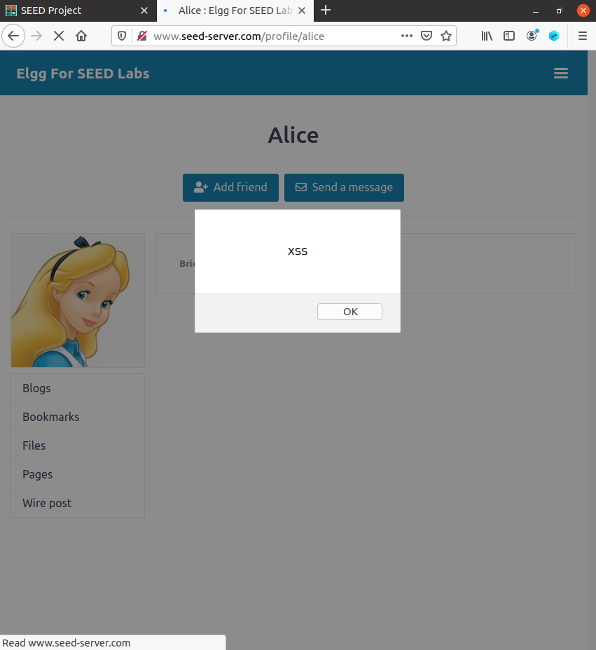
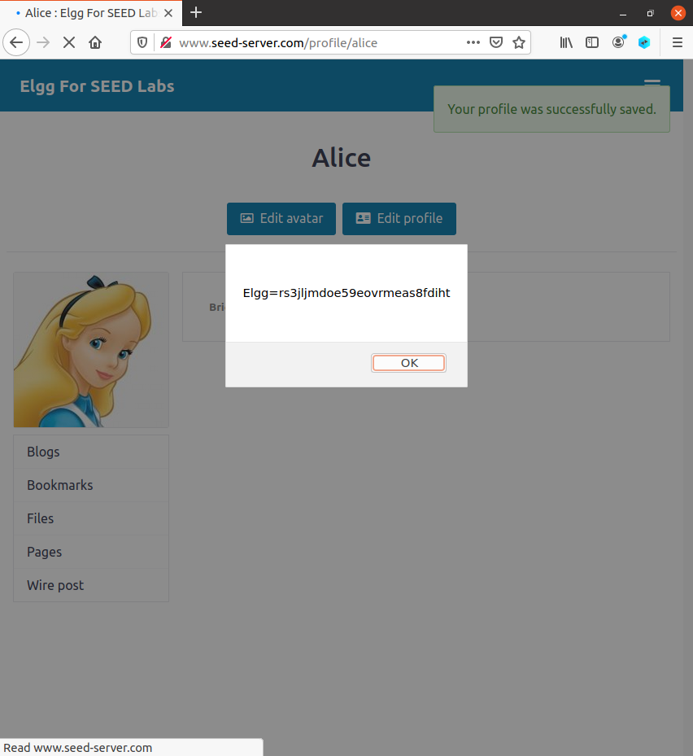
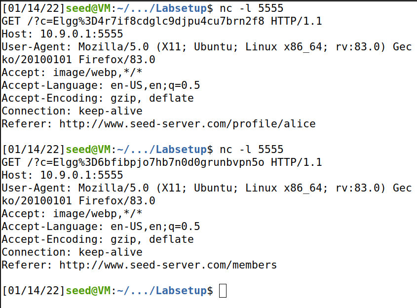

This logbook is divided into 2 sections, one referring to the CTF - week 10, and another concerning the tasks for week 10.

# CTF - Week 10

## Challenge 1
<!---

-->

## Challenge 2

<!---

-->
____
____

# Cross-Site Scripting (XSS) Attack Lab

## Preparation: Getting Familiar with the "HTTP Header Live" tool

<!---

-->

## Task 1: Posting a Malicious Message to Display an Alert Window

<!---

-->

## Task 2: Posting a Malicious Message to Display Cookies

<!---

-->

##  Task 3: Stealing Cookies from the Victim's Machine

<!---

-->

## Task 4: Becoming the Victim's Friend

<!---

-->
