This logbook is referring to the tasks for week 11.

# Public-Key Infrastructure (PKI) Lab

## Task 1: Becoming a Certificate Authoruty (CA)

By running the commands:
```
openssl x509 -in ca.crt -text -noout
openssl rsa -in ca.key -text -noout
```
We were able to see the details about the CA's certificate. 

```
Certificate:
    Data:
        Version: 3 (0x2)
        Serial Number:
            7b:b7:25:4a:9f:5c:be:3f:00:23:53:8c:f6:2c:1a:f6:51:9d:22:5e
        Signature Algorithm: sha256WithRSAEncryption
        Issuer: CN = www.modelCA.com, O = Model CA LTD., C = US
        Validity
            Not Before: Jan 22 02:05:55 2022 GMT
            Not After : Jan 20 02:05:55 2032 GMT
        Subject: CN = www.modelCA.com, O = Model CA LTD., C = US
        Subject Public Key Info:
            Public Key Algorithm: rsaEncryption
                RSA Public-Key: (4096 bit)
                Modulus:
                    00:f2:85:38:08:1d:9b:03:82:d6:bf:c8:bc:a8:15:
                    83:e6:9b:c2:1e:fe:e2:6b:22:b2:1a:3d:f6:5e:dc:
                    d5:38:56:11:a1:6f:f2:28:0d:b9:59:dd:8b:18:fe:
                    6e:2d:1e:8c:70:69:ec:5f:3b:4f:3f:5a:ab:51:73:
                    ec:f0:a2:b3:4a:4e:dc:6f:72:ac:be:2b:c8:28:c7:
                    e6:45:bf:de:3e:1e:2c:f5:44:31:d0:ee:2f:07:4a:
                    d5:07:1e:5c:2c:36:62:88:6d:e4:ee:4e:51:9f:9e:
                    09:82:f9:86:21:94:e4:ea:36:0f:33:9e:8c:9b:07:
                    ab:2b:d2:dc:fa:82:34:29:65:c3:12:1d:14:d9:c1:
                    e2:1a:c9:84:74:c0:51:d2:b5:b7:05:a3:d0:8f:77:
                    f2:24:c5:d8:35:82:17:8b:59:40:6b:c7:9f:26:cc:
                    83:93:73:18:e7:f3:26:64:8c:a3:6c:95:01:21:00:
                    5a:1c:62:2a:2a:44:d4:5a:d1:15:6b:61:a5:dd:16:
                    e6:6a:fd:78:c6:0d:86:2b:25:f7:4b:e1:90:26:6f:
                    4c:03:55:2d:d2:f4:98:0b:b4:5b:fb:4a:6b:84:b8:
                    b0:a2:e9:86:37:21:cd:82:97:9a:29:47:ea:09:97:
                    e6:a5:3e:31:ce:82:92:65:43:60:eb:f8:aa:19:1f:
                    f4:15:1d:df:3d:8b:30:46:eb:3c:2d:86:68:fd:3d:
                    b4:1a:dc:12:7b:12:9e:de:7a:1c:89:f1:2a:6b:2d:
                    5c:85:c6:7b:bf:4c:86:40:49:ae:55:8e:f3:14:2e:
                    46:12:f4:6d:6b:1f:bb:ba:b3:2c:ee:ff:c6:63:92:
                    30:c7:50:b0:df:07:fe:4c:7b:48:63:dd:c9:6e:a1:
                    ac:03:a8:09:2d:a9:e9:c7:a6:ae:48:76:9b:fa:5d:
                    ee:2b:7b:47:27:be:67:06:8c:c5:bf:bd:ff:c9:55:
                    59:32:97:f0:2c:a3:b8:0a:ba:70:fc:73:69:cc:21:
                    12:45:5a:f9:83:88:1b:d1:c7:36:bf:0a:83:49:de:
                    01:bb:1e:9d:ea:03:0d:7e:0b:8b:ed:c1:af:70:03:
                    d5:b5:a7:3d:f3:2b:c2:26:86:3e:a0:07:4c:8f:da:
                    89:64:ab:49:ab:8a:67:b2:96:31:e4:f4:b8:b2:33:
                    97:f7:57:ca:b8:d2:4f:d1:3a:94:9c:32:f2:97:f7:
                    1e:c9:05:8e:ea:37:9c:68:d2:fb:53:3b:78:1f:12:
                    95:88:d6:64:21:a8:74:95:b9:81:c2:29:e0:ef:48:
                    42:0b:04:9c:f5:2a:26:83:b4:85:c7:74:81:f6:95:
                    5b:bf:e5:68:8e:4b:fa:3a:f5:28:57:81:95:f2:75:
                    93:2c:2f
                Exponent: 65537 (0x10001)
        X509v3 extensions:
            X509v3 Subject Key Identifier: 
                D5:12:49:6C:28:F6:46:C8:5A:8E:E4:60:C5:73:B6:17:6A:29:6C:1F
            X509v3 Authority Key Identifier: 
                keyid:D5:12:49:6C:28:F6:46:C8:5A:8E:E4:60:C5:73:B6:17:6A:29:6C:1F

            X509v3 Basic Constraints: critical
                CA:TRUE
    Signature Algorithm: sha256WithRSAEncryption
         00:b0:70:e8:6c:d9:8e:8f:be:d3:56:35:ae:76:13:ed:a6:06:
         d9:5a:a0:2f:51:1e:7e:a0:ee:ce:26:0a:3b:ac:6d:ba:ae:32:
         41:d0:63:d5:cf:f3:a4:f4:38:7f:16:de:73:67:2a:1f:d3:aa:
         20:17:02:e9:08:f5:54:e2:6e:ab:50:db:ce:ed:f0:a6:3b:12:
         7a:83:82:8d:3a:66:8c:e9:6b:0c:bc:05:d7:1b:a3:38:4e:ef:
         73:d3:a8:ce:e7:6f:d5:aa:f2:6b:97:ae:f8:8a:21:0b:3e:5d:
         3b:f6:a2:98:96:b3:b7:97:d5:35:2a:e7:26:77:f4:47:f3:cc:
         76:8d:0a:58:f3:71:66:19:9b:1f:ea:eb:52:8c:42:4f:c8:88:
         b8:56:44:a8:d5:80:f5:fd:bc:d8:5b:07:04:16:9f:e1:33:3e:
         cb:94:2a:01:ce:c9:45:54:43:79:9b:90:69:7a:36:5e:71:47:
         0a:96:36:1b:a0:44:06:bd:af:91:4c:d2:a6:75:fc:1b:aa:e5:
         e0:94:03:2b:22:db:bb:28:c9:31:6e:9b:d1:35:4b:44:4f:ef:
         90:0c:42:91:7e:50:e5:be:8e:67:98:23:4f:2a:14:9e:7b:7d:
         a9:17:fd:2a:e6:36:da:14:39:04:a2:6a:fd:86:b0:ce:e0:ba:
         fc:09:a2:bb:cf:8b:d1:39:d0:3f:3a:53:c4:af:cb:de:f5:0a:
         c5:b3:50:77:da:d5:eb:7b:6a:b3:2f:e9:32:f2:0c:56:31:75:
         78:4d:b0:56:ac:03:cf:da:18:1c:7e:52:e6:86:a3:14:1a:c2:
         04:6e:cc:88:d8:1c:ec:5b:a9:2f:c4:c4:3e:da:81:bb:49:67:
         f5:42:b1:bb:c8:e0:bb:a3:66:23:40:ad:ef:38:f4:e1:14:6a:
         55:58:4b:7e:3b:d8:2e:d5:c7:0f:7b:fe:80:6f:4d:41:7a:c3:
         6b:23:14:3b:cb:b6:a2:28:1d:9b:28:60:14:cd:11:57:67:94:
         13:cf:d4:e9:0c:cd:ea:2f:0a:d4:d5:be:29:8e:d4:e8:6e:2a:
         ff:7a:6c:aa:f6:6a:58:25:40:40:35:e2:02:14:5a:b4:d9:54:
         be:4a:bc:09:4e:40:68:d3:ec:02:19:d0:22:9b:e1:44:d3:32:
         b9:7e:53:00:e7:c8:54:ac:30:67:a9:70:e3:a3:d8:cb:e1:f0:
         84:43:89:65:53:2c:15:26:59:4d:62:30:18:90:ba:e7:7f:bc:
         b6:fe:88:43:b9:be:37:5f:df:2d:44:56:a7:98:dd:a5:83:34:
         81:dd:48:9b:97:2d:4f:55:bb:f4:59:b3:54:1a:a5:e5:b1:1e:
         6e:32:cd:03:b8:33:f8:d9
```
```
Enter pass phrase for ca.key:
RSA Private-Key: (4096 bit, 2 primes)
modulus:
    00:f2:85:38:08:1d:9b:03:82:d6:bf:c8:bc:a8:15:
    83:e6:9b:c2:1e:fe:e2:6b:22:b2:1a:3d:f6:5e:dc:
    d5:38:56:11:a1:6f:f2:28:0d:b9:59:dd:8b:18:fe:
    6e:2d:1e:8c:70:69:ec:5f:3b:4f:3f:5a:ab:51:73:
    ec:f0:a2:b3:4a:4e:dc:6f:72:ac:be:2b:c8:28:c7:
    e6:45:bf:de:3e:1e:2c:f5:44:31:d0:ee:2f:07:4a:
    d5:07:1e:5c:2c:36:62:88:6d:e4:ee:4e:51:9f:9e:
    09:82:f9:86:21:94:e4:ea:36:0f:33:9e:8c:9b:07:
    ab:2b:d2:dc:fa:82:34:29:65:c3:12:1d:14:d9:c1:
    e2:1a:c9:84:74:c0:51:d2:b5:b7:05:a3:d0:8f:77:
    f2:24:c5:d8:35:82:17:8b:59:40:6b:c7:9f:26:cc:
    83:93:73:18:e7:f3:26:64:8c:a3:6c:95:01:21:00:
    5a:1c:62:2a:2a:44:d4:5a:d1:15:6b:61:a5:dd:16:
    e6:6a:fd:78:c6:0d:86:2b:25:f7:4b:e1:90:26:6f:
    4c:03:55:2d:d2:f4:98:0b:b4:5b:fb:4a:6b:84:b8:
    b0:a2:e9:86:37:21:cd:82:97:9a:29:47:ea:09:97:
    e6:a5:3e:31:ce:82:92:65:43:60:eb:f8:aa:19:1f:
    f4:15:1d:df:3d:8b:30:46:eb:3c:2d:86:68:fd:3d:
    b4:1a:dc:12:7b:12:9e:de:7a:1c:89:f1:2a:6b:2d:
    5c:85:c6:7b:bf:4c:86:40:49:ae:55:8e:f3:14:2e:
    46:12:f4:6d:6b:1f:bb:ba:b3:2c:ee:ff:c6:63:92:
    30:c7:50:b0:df:07:fe:4c:7b:48:63:dd:c9:6e:a1:
    ac:03:a8:09:2d:a9:e9:c7:a6:ae:48:76:9b:fa:5d:
    ee:2b:7b:47:27:be:67:06:8c:c5:bf:bd:ff:c9:55:
    59:32:97:f0:2c:a3:b8:0a:ba:70:fc:73:69:cc:21:
    12:45:5a:f9:83:88:1b:d1:c7:36:bf:0a:83:49:de:
    01:bb:1e:9d:ea:03:0d:7e:0b:8b:ed:c1:af:70:03:
    d5:b5:a7:3d:f3:2b:c2:26:86:3e:a0:07:4c:8f:da:
    89:64:ab:49:ab:8a:67:b2:96:31:e4:f4:b8:b2:33:
    97:f7:57:ca:b8:d2:4f:d1:3a:94:9c:32:f2:97:f7:
    1e:c9:05:8e:ea:37:9c:68:d2:fb:53:3b:78:1f:12:
    95:88:d6:64:21:a8:74:95:b9:81:c2:29:e0:ef:48:
    42:0b:04:9c:f5:2a:26:83:b4:85:c7:74:81:f6:95:
    5b:bf:e5:68:8e:4b:fa:3a:f5:28:57:81:95:f2:75:
    93:2c:2f
publicExponent: 65537 (0x10001)
privateExponent:
    54:e5:a9:cd:bd:7f:6c:65:3b:03:fc:23:7e:bb:b9:
    66:db:13:c3:81:fa:85:02:aa:52:61:6a:83:9e:ce:
    cd:5f:e3:e0:1d:ae:29:b3:54:35:4f:46:c8:43:19:
    12:96:65:17:5d:1d:2f:e1:35:46:ba:58:ca:b4:c8:
    37:1c:dd:a2:9f:a4:af:26:f7:ad:c2:e9:d8:cc:d1:
    a1:8d:1f:21:a3:b2:9d:51:78:16:e9:aa:70:e5:13:
    59:e0:98:e7:a9:4a:28:f4:3f:75:e4:d8:d2:05:a2:
    d2:c4:c2:dd:b2:9f:c8:15:90:90:c3:69:f9:43:5f:
    fa:81:60:76:19:6a:65:2b:88:74:28:d6:09:bc:c3:
    88:19:0f:53:47:97:dd:29:5b:9e:8f:d0:0c:c9:32:
    6d:09:0d:3c:fe:03:7b:f6:8c:84:ae:66:da:50:31:
    a7:46:5d:6b:a5:44:c5:62:2e:3b:6e:95:ec:95:90:
    f5:ea:af:54:08:b0:45:f2:77:8b:15:ad:d8:8d:91:
    af:d6:77:96:ed:59:10:75:c3:f2:3e:4e:16:06:54:
    17:be:93:c2:0b:79:c6:6f:26:db:fb:1b:54:64:cb:
    00:dc:ba:ed:45:da:09:63:44:c6:3a:b4:85:13:35:
    dc:96:bf:1c:c9:bc:b1:d2:3a:75:a0:a0:fb:16:a2:
    7c:ab:7a:b2:64:10:7b:9d:32:8c:b8:36:98:6b:f7:
    04:ae:45:95:88:01:07:94:79:5f:c6:65:db:4c:53:
    33:ca:11:9b:89:ae:d1:97:9f:b1:8a:5a:79:38:53:
    b5:fa:92:2b:22:3a:93:d7:e4:2a:69:8f:08:fb:51:
    ad:16:ea:a0:71:bc:70:40:9a:e0:7d:9f:a2:d6:9b:
    47:2d:d6:a9:6b:24:f7:7c:e6:6f:b5:19:fe:f3:91:
    15:2b:bd:f2:ea:f7:00:91:fe:1b:04:5e:05:ec:ad:
    18:62:03:29:7a:f9:8f:e7:e8:e8:f7:7f:db:71:32:
    0f:9f:af:3d:1f:7a:85:0b:03:a6:7d:ff:6b:e6:d3:
    02:f6:1d:9c:ab:bb:c0:68:cc:3a:09:b5:45:d5:a2:
    77:05:ff:62:22:f5:02:82:6d:e3:d2:e7:0b:c4:97:
    a2:7a:a6:19:3e:9a:55:91:a1:d5:e2:77:73:93:df:
    2e:67:6c:02:09:c0:c6:7f:fe:8d:db:85:8a:6f:bc:
    f5:5e:ed:51:4b:d3:81:a0:3d:88:bf:70:df:8b:8c:
    02:3b:b8:88:24:dd:24:69:d7:15:18:5e:80:ee:f3:
    7c:21:4f:9b:21:c9:fd:f5:f2:4e:41:34:16:79:9a:
    c8:d7:66:10:fc:59:29:6e:65:f3:2e:e0:e3:54:3b:
    17:b1
prime1:
    00:f9:68:c0:9e:e6:cc:da:80:02:9c:12:d6:19:ed:
    22:7c:fc:a4:06:21:64:5a:88:1e:05:cb:4b:aa:13:
    d1:4e:d2:ec:5e:24:72:80:96:ab:45:b8:4b:30:b7:
    f5:66:24:ea:04:b0:56:b0:ad:53:c7:48:d4:11:42:
    df:74:97:10:37:82:06:21:e7:99:dd:7d:95:dd:d1:
    93:c7:5f:c1:6e:22:f1:e7:29:c4:3f:78:59:33:3f:
    5a:14:01:cf:a6:62:aa:0a:40:d0:23:97:8e:c5:e9:
    96:37:ee:b4:75:f3:e5:05:1c:d3:bf:4d:c9:2d:d8:
    a3:b0:15:b0:41:92:e3:8b:71:e5:4f:ba:4b:26:f3:
    a2:1e:5b:0a:99:84:7d:22:24:c9:91:5c:59:cf:af:
    98:f2:41:a3:02:42:26:d9:64:d6:03:ae:8d:f7:bf:
    09:e6:c7:69:bd:d4:2a:9e:4e:82:0d:66:c5:34:48:
    aa:5b:30:f9:01:d6:48:d8:05:9c:99:24:04:2d:6d:
    3b:35:d4:92:66:3b:39:ba:0a:aa:e1:89:76:d6:2a:
    9b:24:d3:bd:f9:1f:bf:de:1b:14:df:31:ce:96:4e:
    68:58:11:4c:a4:93:f9:1e:b6:09:07:3b:63:64:52:
    d7:25:ee:36:54:b7:76:7f:ae:16:11:15:7c:24:90:
    8f:53
prime2:
    00:f8:ed:dd:25:63:08:96:14:02:44:70:41:c2:03:
    15:dc:3c:a6:d9:2d:40:64:f9:b7:60:51:4a:34:18:
    e0:c6:6c:64:bc:ad:82:fe:ed:eb:4b:9e:0e:7a:24:
    31:e2:31:ad:5b:2a:35:b8:00:f4:00:58:c0:e8:eb:
    7d:ab:0d:06:fb:8c:35:99:81:45:46:86:e4:8b:b9:
    6e:ae:ac:55:12:0a:11:c8:60:de:84:06:6a:73:30:
    df:c4:35:94:b2:6e:26:5b:7a:a2:f0:3f:e5:fe:29:
    8b:a5:a9:a2:83:4b:d3:62:e1:4e:1f:f5:81:02:06:
    e5:3f:27:cb:58:4d:a6:82:e8:84:d1:1a:6e:6e:94:
    c3:00:1e:f4:a4:a6:09:5d:21:ed:33:36:0e:a6:7f:
    a4:25:03:5d:25:9a:a1:08:d0:b4:05:dc:8e:0a:a7:
    d1:67:04:0e:03:f8:df:12:90:59:81:34:44:0a:ae:
    dc:13:d9:b7:5b:db:ca:d6:3d:29:c1:ce:55:0f:fa:
    1d:ef:d5:a8:1f:e1:e4:a0:bf:d1:11:b7:db:89:d7:
    42:25:0b:f6:00:ba:e0:a0:10:be:d6:d1:64:6f:0a:
    4c:2f:a9:66:f0:3c:60:ac:9d:dc:df:77:fd:1c:b6:
    4e:f5:5d:1a:96:cd:f0:8a:48:b7:5a:a1:55:40:94:
    80:35
exponent1:
    00:ee:64:54:09:0e:6e:ac:43:43:3b:4f:3d:da:56:
    31:6a:ea:49:15:9b:01:43:0f:6c:32:f9:98:7f:1e:
    a6:28:03:af:ee:64:44:15:e8:ee:18:9c:09:32:ae:
    03:1f:f9:14:be:1a:97:22:14:ea:49:47:b1:7c:36:
    41:44:3d:c8:40:66:45:da:4e:77:61:a0:52:89:4d:
    73:45:54:9f:9c:d8:46:04:40:85:d6:6d:00:45:dd:
    be:09:f5:99:37:5e:83:4d:7d:99:f5:0b:3e:6a:a9:
    d4:ed:ed:7a:0c:6c:6d:71:af:96:2d:fa:f9:da:9a:
    82:0b:23:0f:ef:fd:a9:05:76:7e:4a:f0:b4:38:ad:
    13:3e:94:a2:d3:0e:32:55:5a:78:58:3a:bf:95:a6:
    30:39:0e:c7:f2:b6:ac:4f:8a:f4:8d:5c:61:52:77:
    05:cd:d2:b9:9d:ba:98:69:ec:7c:9e:b6:a6:b4:4c:
    e8:98:75:7c:ed:66:97:05:f4:87:34:51:9a:b4:98:
    fd:c9:7c:3f:da:fb:ad:37:c8:4e:81:79:55:5f:6c:
    26:12:d3:59:78:30:02:c3:17:7b:a1:c3:07:c5:df:
    78:19:05:a0:0e:87:69:cd:13:0e:1a:1d:87:e9:32:
    cd:76:f1:f4:78:91:4b:f0:ca:c3:48:dd:12:66:18:
    cf:05
exponent2:
    00:a6:c1:b9:f6:f4:bb:e8:c5:e8:aa:ee:44:ae:f2:
    a0:2f:54:96:35:40:c2:35:a2:af:bc:9f:58:45:44:
    31:37:db:9f:34:62:4c:31:f9:32:3a:0a:dd:09:e7:
    bb:5f:1b:06:55:df:15:f3:78:f7:fc:4f:78:93:d0:
    45:f4:53:9a:cc:e2:a5:79:7b:06:ec:73:2b:21:8b:
    0c:61:89:62:c7:dd:e5:01:c6:1a:ea:78:dd:d0:e2:
    f9:d4:18:4c:cf:a7:48:9c:d9:af:d3:a0:0a:b3:d4:
    23:0f:cc:6e:e8:e3:df:ed:0a:9f:ea:7a:ed:7c:6d:
    20:1f:c9:c9:c8:12:e4:ac:27:95:e9:fa:79:e6:2c:
    53:e1:7d:db:47:7d:4f:22:8b:ba:ba:26:c9:73:b2:
    68:44:bf:57:23:fc:cd:49:f9:7d:cf:bb:6b:90:29:
    d1:f6:df:d9:7f:c1:b5:b6:5a:eb:0a:c9:f7:96:ec:
    82:d3:ed:72:8e:df:d3:a6:e7:7c:54:af:a3:7e:3b:
    80:d8:8c:d9:be:d9:f5:ed:d5:f1:f9:9b:a0:3f:5b:
    eb:9c:a3:c1:9d:c5:92:fa:c7:9d:00:8d:6f:69:8f:
    8d:70:14:5c:b8:2c:ca:5a:78:ba:61:1d:a1:7b:1d:
    8a:11:86:d8:6c:13:f3:c2:bf:69:cd:15:ec:e5:81:
    55:cd
coefficient:
    39:7d:da:92:97:b2:88:79:79:e6:02:2a:a7:e9:d4:
    09:eb:72:f6:94:d8:1d:a4:63:6d:d8:24:57:c0:0d:
    fa:a6:f5:88:d3:3d:1f:45:a5:52:c7:6c:6f:86:37:
    96:59:a9:78:a2:73:f1:9a:2b:b4:4b:59:c0:62:52:
    64:4d:46:64:c7:cc:91:ff:a7:a0:b0:f8:0c:8f:47:
    80:d5:1d:4a:b7:ec:01:c9:4c:93:7f:a3:9c:17:28:
    7c:e1:07:ca:ee:62:68:d2:9c:7b:d8:f6:37:69:01:
    f3:ad:fd:14:6f:76:27:1e:c7:9c:b3:5f:57:d6:cb:
    8f:95:c0:23:09:0a:4b:57:70:58:7d:51:d8:8c:86:
    2c:42:9d:c3:e0:15:48:41:d6:c9:00:32:20:b4:21:
    a8:06:a7:b6:10:fa:38:b0:62:f0:bd:2a:bb:de:80:
    a7:fc:be:1c:91:a6:17:2a:a7:18:f1:05:65:18:30:
    3b:2b:69:83:0f:a1:8f:d4:53:e3:30:81:46:43:51:
    e3:7b:a2:e2:00:2c:7b:ad:dd:b1:4e:55:8d:04:bd:
    1d:1a:f1:ea:95:18:5e:16:c9:a8:34:80:b2:2e:1d:
    e2:9a:fa:5f:35:c3:72:de:65:bb:15:1e:6a:05:c8:
    89:1e:45:bb:ca:2e:a2:5d:21:f0:05:94:4a:77:5b:
    fc
```

#### **What part of the certificate indicates this is a CA’s certificate?**
The certificate contains a Basic Constraints extension with the CA flag set to TRUE.
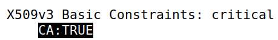
#### **What part of the certificate indicates this is a self-signed certificate?**
The issuer and the subject are the same.
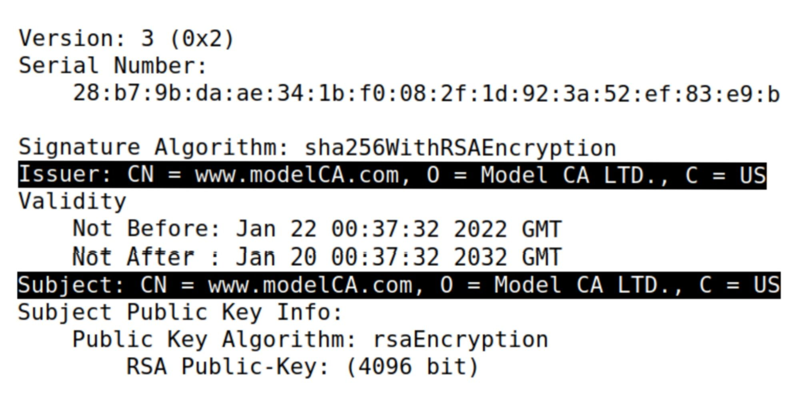
#### **In the RSA algorithm, we have a public exponent *e*, a private exponent *d*, a modulus *n*, and two secret numbers *p* and *q*, such that *n = pq*. Please identify the values for these elements in your certificate and key files**
#### - public exponent *e* :
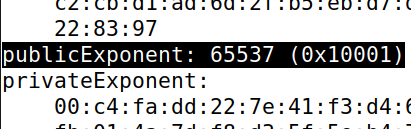
#### - private exponent *d* :
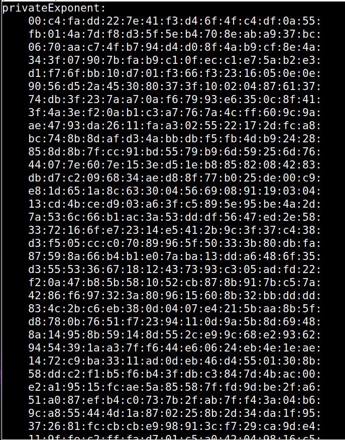
#### - modulus *n* :
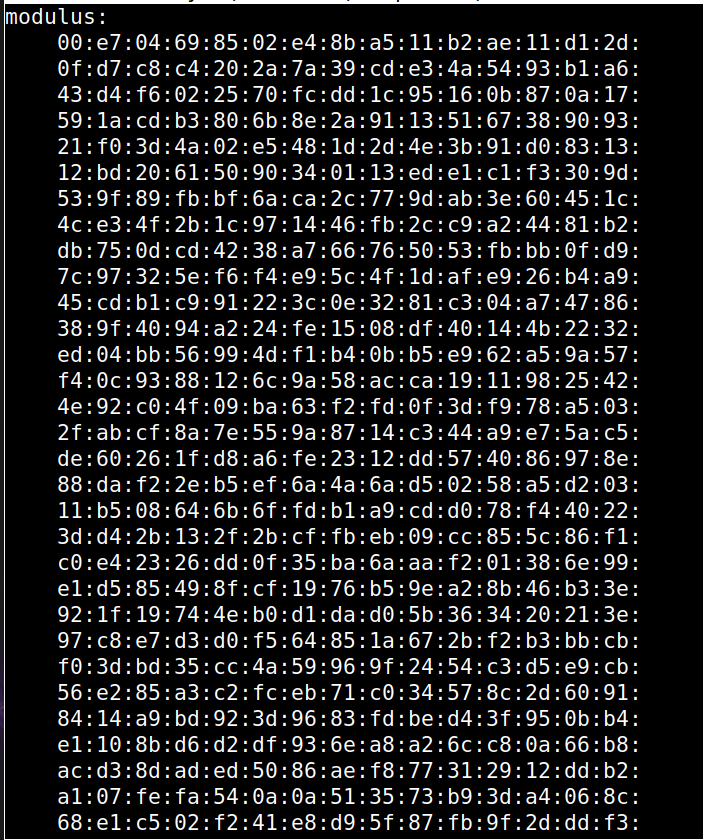
#### - secret number *p* :
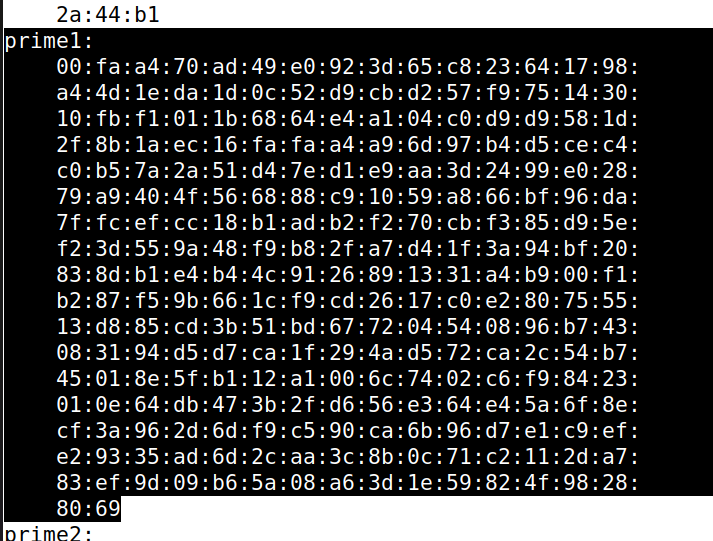
#### - secret number *q* :
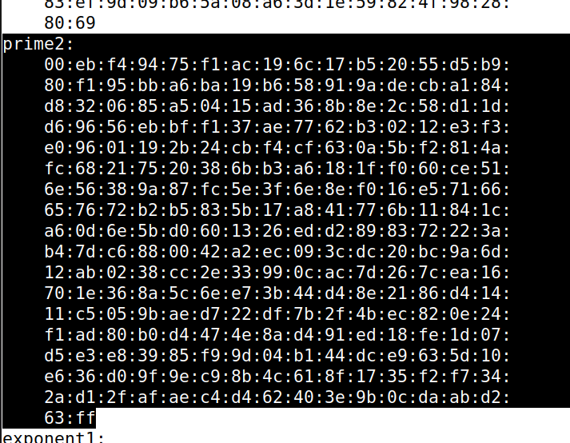

## Task 2: Generating a Certificate Request for Your Web Server

During this task, we generated a CSR for *www.l07g03.com* as well as the pair of public/private key, adding the alternative names (*www.l07g03A.com* and *www.l07g03B.com*):
```
Certificate Request:
    Data:
        Version: 1 (0x0)
        Subject: CN = www.l07g03.com, O = L07G03, C = US
        Subject Public Key Info:
            Public Key Algorithm: rsaEncryption
                RSA Public-Key: (2048 bit)
                Modulus:
                    00:d0:2a:f7:39:9b:94:54:4f:d3:f6:d6:f7:d4:f5:
                    06:96:12:55:6f:72:d6:1b:b7:1c:3a:6d:58:eb:db:
                    fe:06:8f:57:39:31:c0:ef:c7:0d:f0:44:08:ce:b4:
                    cb:33:a5:e2:f5:f1:c8:f9:98:26:9b:3c:ff:6b:53:
                    f7:a4:ec:e0:82:41:ef:74:17:c7:fa:fa:0d:31:71:
                    69:78:e3:ad:c9:e5:74:49:a5:fd:6d:fe:53:14:67:
                    6e:b3:6f:08:9b:08:dd:14:b3:b3:ff:67:f0:a4:7b:
                    c1:b6:9f:19:da:d3:b9:d4:83:e8:c5:f6:90:02:e4:
                    14:9a:51:eb:42:ed:c4:37:5a:f2:21:30:f0:2e:27:
                    59:f8:3c:82:24:3f:59:e9:90:7d:01:64:8d:d5:90:
                    dc:be:43:08:b2:f0:cc:b8:3c:80:8f:ee:eb:cd:ab:
                    7b:b2:ee:16:e0:32:13:de:37:46:5d:78:47:8b:6f:
                    88:83:51:79:6e:3b:4e:c8:e3:9b:43:ae:18:74:4c:
                    3b:7b:f1:db:6c:c9:8a:01:34:ce:15:67:ba:d0:d9:
                    6e:04:da:76:35:82:7c:67:5f:5c:7c:7e:c8:d5:bb:
                    e0:54:8f:66:2c:5c:f0:cd:14:6a:95:0a:f8:76:95:
                    e8:39:e8:31:55:09:94:df:49:b2:4b:82:70:ec:df:
                    f8:77
                Exponent: 65537 (0x10001)
        Attributes:
        Requested Extensions:
            X509v3 Subject Alternative Name: 
                DNS:www.l07g03.com, DNS:www.l07g03A.com, DNS:www.l07g03B.com
    Signature Algorithm: sha256WithRSAEncryption
         54:e5:c5:f2:83:8f:9a:e7:1c:d1:e4:8e:37:02:22:39:e1:a3:
         3e:67:ac:31:69:ab:ca:0c:6b:56:86:64:be:bf:e5:6b:87:be:
         c9:d5:88:00:7a:a4:12:76:f9:ae:c2:d3:39:2e:43:c9:42:f9:
         29:2e:67:43:a1:f2:91:eb:10:a0:85:22:26:70:70:b9:24:cc:
         8c:41:b8:65:54:7c:49:cb:65:69:df:5b:79:38:19:79:ba:72:
         d1:f3:b2:f0:06:3b:70:c0:36:02:79:b5:5d:6a:3f:17:e6:50:
         c6:a9:08:04:61:1a:9e:26:cf:d0:68:2d:fc:df:d0:62:a6:59:
         75:67:64:0e:07:13:3f:88:26:37:48:3b:8b:fe:b1:ab:65:fe:
         a6:cc:de:47:13:c5:0f:af:40:ea:42:05:49:f3:2e:01:d4:b4:
         f2:b8:6c:82:0e:49:10:88:3f:4d:9f:71:9b:b6:14:56:0e:f8:
         aa:87:2d:5d:07:93:a1:05:4d:0b:c5:27:c7:f9:f1:d1:e9:5a:
         b0:7c:22:f4:1c:11:e1:e0:01:41:57:da:57:e5:99:f7:72:03:
         ab:60:cd:8c:67:66:af:2f:2d:b6:a2:3e:11:bb:53:e9:c0:63:
         45:8a:6e:ff:df:7d:da:c9:15:c8:68:59:ca:2b:c8:f8:56:f4:
         96:7d:4b:b4
```
```
Enter pass phrase for l07g03.key:
RSA Private-Key: (2048 bit, 2 primes)
modulus:
    00:d0:2a:f7:39:9b:94:54:4f:d3:f6:d6:f7:d4:f5:
    06:96:12:55:6f:72:d6:1b:b7:1c:3a:6d:58:eb:db:
    fe:06:8f:57:39:31:c0:ef:c7:0d:f0:44:08:ce:b4:
    cb:33:a5:e2:f5:f1:c8:f9:98:26:9b:3c:ff:6b:53:
    f7:a4:ec:e0:82:41:ef:74:17:c7:fa:fa:0d:31:71:
    69:78:e3:ad:c9:e5:74:49:a5:fd:6d:fe:53:14:67:
    6e:b3:6f:08:9b:08:dd:14:b3:b3:ff:67:f0:a4:7b:
    c1:b6:9f:19:da:d3:b9:d4:83:e8:c5:f6:90:02:e4:
    14:9a:51:eb:42:ed:c4:37:5a:f2:21:30:f0:2e:27:
    59:f8:3c:82:24:3f:59:e9:90:7d:01:64:8d:d5:90:
    dc:be:43:08:b2:f0:cc:b8:3c:80:8f:ee:eb:cd:ab:
    7b:b2:ee:16:e0:32:13:de:37:46:5d:78:47:8b:6f:
    88:83:51:79:6e:3b:4e:c8:e3:9b:43:ae:18:74:4c:
    3b:7b:f1:db:6c:c9:8a:01:34:ce:15:67:ba:d0:d9:
    6e:04:da:76:35:82:7c:67:5f:5c:7c:7e:c8:d5:bb:
    e0:54:8f:66:2c:5c:f0:cd:14:6a:95:0a:f8:76:95:
    e8:39:e8:31:55:09:94:df:49:b2:4b:82:70:ec:df:
    f8:77
publicExponent: 65537 (0x10001)
privateExponent:
    00:b9:c6:4e:61:eb:f5:81:14:c8:ce:96:64:10:7a:
    27:49:90:cd:0c:2c:08:e6:2d:11:15:17:76:ee:ee:
    a2:92:4a:24:06:57:df:9e:5d:1f:94:57:b3:20:7d:
    fa:86:7a:39:c5:51:e5:10:d2:77:49:bd:33:19:1e:
    93:78:6d:29:a3:35:a2:b4:11:71:18:0b:45:f0:e5:
    0c:c2:a5:35:f8:63:3c:d7:69:3a:75:8a:2d:ac:9c:
    ee:0f:56:3c:f0:d7:05:2e:2f:7d:a8:a6:a2:fc:b7:
    b1:56:00:40:fb:a8:4e:44:59:00:48:83:55:5c:2f:
    1e:2f:e6:81:b5:76:29:d1:57:4d:4f:c0:b7:3e:b1:
    5a:ea:1f:99:8b:7d:65:fb:1d:be:26:f4:a1:4a:76:
    9b:bd:3a:17:24:83:d9:a5:02:19:e8:e0:95:71:22:
    ca:1b:95:f8:e2:7e:b0:5c:a3:51:b1:b2:9f:e3:81:
    cb:a5:37:07:c9:00:7f:39:de:4a:90:bb:08:b9:5d:
    48:e8:84:c0:0c:f9:94:5a:8b:01:3e:82:d8:02:ae:
    ac:ff:ae:83:ab:90:45:d6:50:91:bb:75:c3:7e:c7:
    0e:7d:af:36:f7:87:24:a9:98:7c:62:b8:cc:d1:70:
    bb:e0:ae:a4:7b:bd:06:a4:e4:2f:40:09:a0:57:07:
    15:31
prime1:
    00:ee:bd:4b:6b:ef:8a:fc:23:7d:d6:25:35:7e:0e:
    a8:cf:a7:cf:2a:14:7d:c5:fd:f9:a3:e6:57:be:b3:
    91:a2:c5:30:22:66:30:62:5d:54:5e:f1:3b:f3:63:
    cc:73:65:02:92:72:28:08:5a:bd:d1:0a:11:c6:3e:
    ba:f6:22:c4:68:28:8c:d6:b3:39:a9:91:5f:33:47:
    4b:8e:c0:ce:15:70:ec:55:7b:e7:e1:c3:9e:cb:d4:
    ee:54:05:13:8c:25:31:c1:74:95:e7:f3:5a:11:30:
    27:2a:2f:de:da:3d:be:cc:bc:66:93:b2:ab:57:9c:
    b0:ab:30:2c:8e:8c:2c:49:8f
prime2:
    00:df:37:d6:4e:6e:73:01:55:53:af:6f:ab:35:26:
    1b:af:19:02:90:ab:c5:9e:65:76:be:1e:6c:1c:50:
    73:e0:c2:7b:ce:cf:a3:e9:ef:0a:aa:7d:50:3c:d5:
    ea:95:87:aa:9b:13:a0:23:b0:68:13:59:36:ca:58:
    ce:2c:90:18:87:9e:49:13:a2:73:d9:61:7b:3c:b2:
    06:c8:da:d6:da:2d:51:f7:55:62:3f:f0:fe:9b:56:
    20:e5:e3:42:1d:6e:48:27:2d:e5:5d:54:92:ae:2a:
    ad:34:ee:4a:84:c4:2c:14:f5:38:71:ac:88:a4:74:
    21:0d:6d:1e:fc:5c:82:de:99
exponent1:
    00:e6:c8:94:75:35:ae:1c:49:4e:e6:c9:37:69:b1:
    50:1c:d4:f2:5d:92:4b:77:2f:29:b8:f7:fd:90:7a:
    d3:e9:0e:47:96:a9:44:52:82:38:02:43:9e:99:8c:
    ba:e2:3e:1d:fb:65:61:2f:9a:50:6e:18:16:d0:96:
    69:73:70:6e:7e:e5:dc:27:dc:3f:7c:9c:eb:f3:8d:
    13:0c:5f:73:98:a4:7d:c1:b1:32:9a:3a:d9:71:df:
    57:b8:5e:e3:e3:91:3d:04:ee:e7:ce:be:9f:2d:88:
    68:03:cf:1c:d5:c9:e4:7c:d4:0f:30:ee:01:d6:82:
    c1:01:eb:62:d7:35:c7:c6:1f
exponent2:
    00:86:49:ae:49:03:13:77:12:e1:44:a2:f6:aa:03:
    e2:15:c6:03:10:0b:f6:d8:a3:0b:fb:b6:8b:ad:c1:
    0c:e5:83:bb:3e:21:16:e8:8e:a1:a9:0d:b8:ae:d0:
    b6:ce:fc:8e:3b:bb:63:d4:f4:b4:b8:27:2c:da:30:
    f0:e0:48:54:29:8a:a5:46:05:ae:92:71:9d:d5:56:
    f8:d3:ef:2b:e0:97:f1:3e:ce:04:4c:99:6c:63:01:
    3e:cb:6e:9c:00:de:ae:d3:bb:3d:c8:97:2f:a3:4e:
    13:63:cb:93:d3:29:bd:a7:62:1b:71:ef:ad:48:da:
    80:63:f6:68:f4:c3:a7:0b:c9
coefficient:
    45:65:d8:9c:34:59:bb:25:58:1f:2d:63:61:71:02:
    37:e4:ea:02:2b:08:0a:4c:a5:c1:c5:4b:3e:33:e3:
    55:7d:ba:8d:0b:ed:79:ef:7e:84:5d:bd:7d:f2:4f:
    b3:93:65:5d:75:4a:01:6c:6b:31:01:82:27:9c:0a:
    dd:5c:7a:99:64:bf:30:07:eb:84:87:c1:5c:9b:5e:
    95:a8:6b:6e:7c:78:12:46:69:0b:bb:2f:a4:d1:ea:
    da:93:7a:c6:f4:68:a3:a2:47:11:e9:1b:05:ce:6f:
    7a:7d:07:80:cc:d6:71:7d:cf:91:81:dd:7b:b5:c9:
    af:eb:a0:71:3b:08:a6:e6
```

##  Task 3: Generating a Certificate for your server

During this task, we needed to have the CA's signature for the CSR to form a certificate. After that, we concluded that the alternative names we wrote in the previous task were included

```
Using configuration from /usr/lib/ssl/openssl.cnf
Enter pass phrase for ca.key:
Check that the request matches the signature
Signature ok
Certificate Details:
        Serial Number: 4102 (0x1006)
        Validity
            Not Before: Jan 22 03:11:41 2022 GMT
            Not After : Jan 20 03:11:41 2032 GMT
        Subject:
            countryName               = US
            organizationName          = L07G03
            commonName                = www.l07g03.com
        X509v3 extensions:
            X509v3 Basic Constraints: 
                CA:FALSE
            Netscape Comment: 
                OpenSSL Generated Certificate
            X509v3 Subject Key Identifier: 
                0F:7A:B3:75:A1:AF:A1:22:F0:5E:F3:88:EF:5A:99:15:CF:89:21:01
            X509v3 Authority Key Identifier: 
                keyid:D5:12:49:6C:28:F6:46:C8:5A:8E:E4:60:C5:73:B6:17:6A:29:6C:1F

            X509v3 Subject Alternative Name: 
                DNS:www.l07g03.com, DNS:www.l07g03A.com, DNS:www.l07g03B.com
Certificate is to be certified until Jan 20 03:11:41 2032 GMT (3650 days)

Write out database with 1 new entries
Data Base Updated
```

## Task 4: Deploying Certificate in an Apache-Based HTTPS Website

During this task we had to set up our own HTTPS site. For that, we had the following apache configuration:

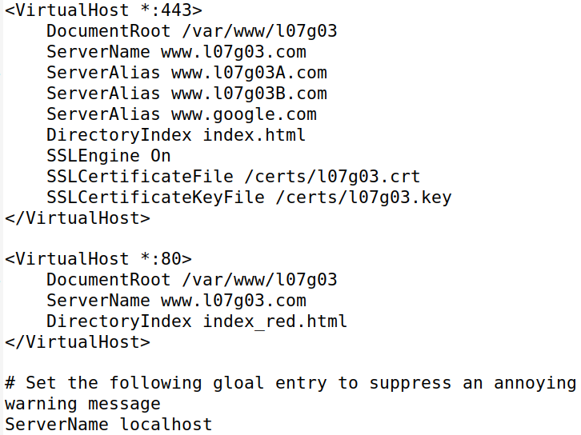

After running ```service apache2 start``` we were able to see the webpage with a red background. For completing the task, we added, in the browser, the CA certificate. After that, the webpage would appear like this:

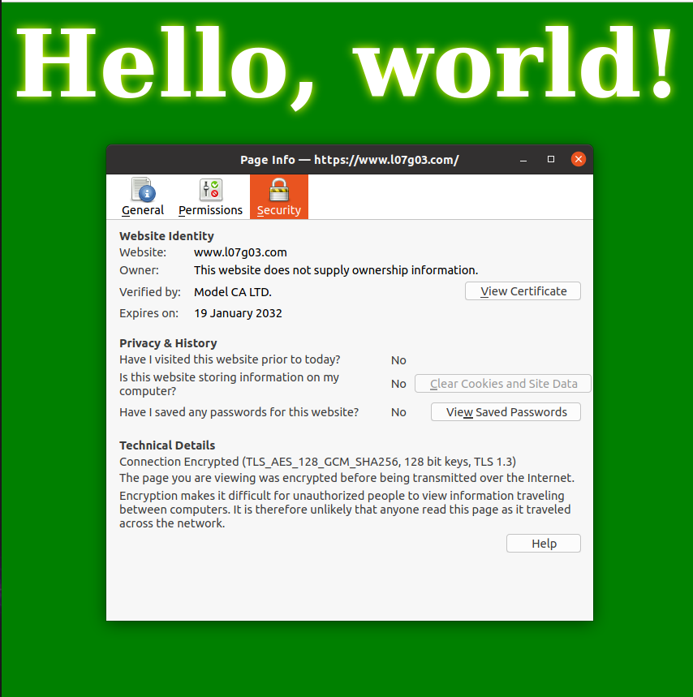

## Task 5: Launching a Man-In-The-Middle Attack

During this task, we chose our target website (www.google.com). After that, we modified the */etc/hosts* file to emulate the result of a DNS cache positioning attack by mapping the hostname to our web server:
```10.9.0.80   www.google.com```
After that, when we access *www.google.com*, we are able to see the page, but with a warning about it's insecurity. This happens because, at this point, we had a CA's certificate does not contain the google website.

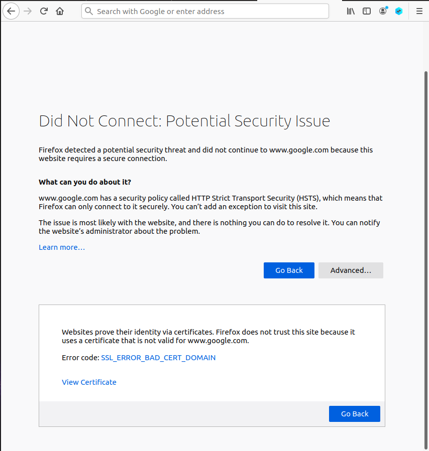

## Task 6: Launching a Man-In-The-Middle Attack with a Compromised CA

During this task, we had the goal of not raising any suspicion from opening the target website. For that, we added *www.google.com* to the alternative names. After that, the page would be like the following picture:

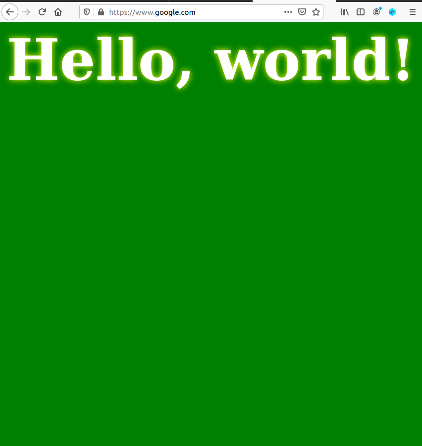
