This logbook is divided into 2 sections, one referring to the CTF - week 4, and another concerning the tasks for week 4.

# CTF - Week 4

## Step 1 - recognition

The first task was the recognition phase, where all the information that could be useful to help us explore and exploit the vulnerabilities in the website was collected, such as wordpress or other plugins versions, existing registered users and their usernames. Some of the information collected is listed below.

Users:
* admin
* Orval Sanford

Both on WordPress Hosting, © Secure WP Hosting 2021

Versions:
* Wordpress 5.8.1.
* WooCommerce plugin 5.7.1.
* Booster for WooCommerce plugin 5.4.3.

Any of this information can lead to the discovery of vulnerabilities, which takes us to the second step.

## Step 2 - Search for vulnerabilities

After the recognition was done, a research of the collected information was made in order to confirm if the software had any known vulnerabilities. Search engines and CVE databases such as https://cvedetails.com/ were used to look for vulnerabilities that affect the versions of the plugins that were found.

## Step 3 - Chosing the vulnerability

Given that the objective was to login as another user, we needed to find a vulnerability that allowed us to do so. After some research, the CVE-2021-34646 was found, which targeted versions up to, and including, 5.4.3, of the Booster for WooCommerce WordPress plugin (found in step 1). This made the system vulnerable to authentication bypass via the process_email_verification function due to a random token generation weakness in the reset_and_mail_activation_link function found in the ~/includes/class-wcj-emails-verification.php file. This allows attackers to impersonate users and trigger an email address verification for arbitrary accounts, including administrative accounts, and automatically be logged in as that user, including any site administrators. For this reason, this CVE was found to be an adequate one, once it fulfilled the initial goal.

## Step 4 - Finding an exploit

...

____
____

# Environment Variable and Set-UID Program Lab

## Task 1: Manipulating Environment Variables

In the first task, several commands such as env, printenv, export and unset, among others, were used in order to have a better understanding of the functioning and manipulation of environment variables.

* Firstly, by using the printenv command we were able to print out the environment variables, as seen below. 

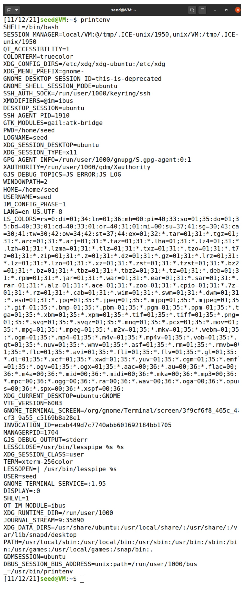

* Secondly, we used export and unset in order to manipulate the environment variables. When using export without any further arguments, it is returned a list of the environment variables (similarly to printenv), as shown in the first screenshot.

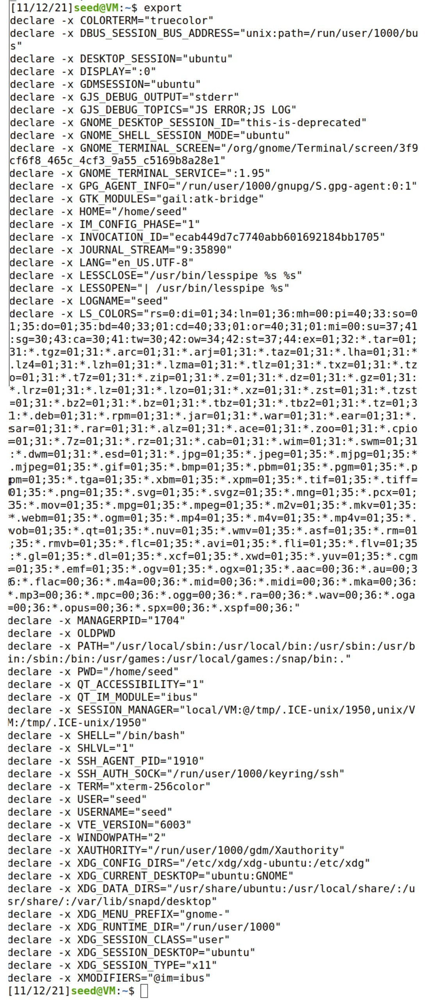

Here, we can see that HOME has a default value of "/home/seed". Then, when inserting a variable name as argument, as shown in the second screenshot, as well as its new value (/home/seed/cenas), we were able to set this new value to the HOME variable. Afterwards, when unsetting the home variable we deleted it. In the end of the exercise we altered it so it was the same as the beginning.

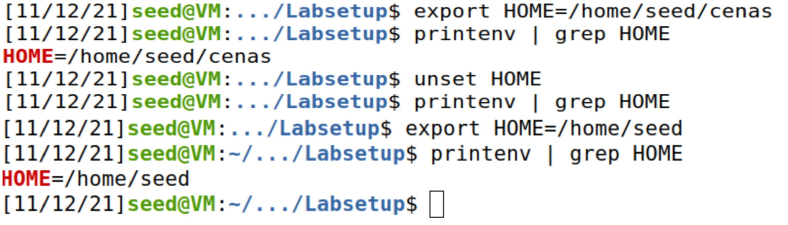

## Task 2: Passing Environment Variables from Parent Process to Child Process

During this exercise we noticed that the output of the two cases was the same, witch means that the environment variables of a parent process and a child process are the same. We concluded that when a fork happens, a new process is created by duplicating the calling process, so they have the same content.

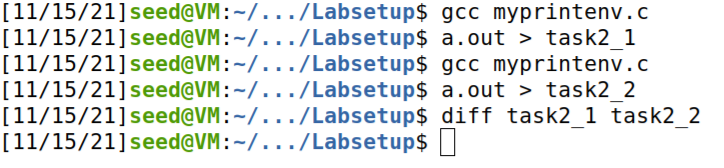

## Task 3: Environment Variables and execve()

The output of the first version of the code returns nothing (as demonstrated in the picture bellow), however, the second version outputs the intended content. We concluded that it happens because the command excve does not return the environment by default and so it needs to be specified.

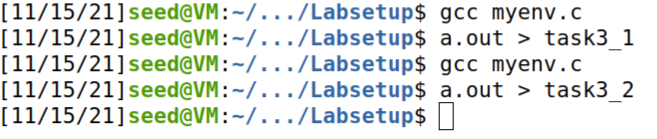
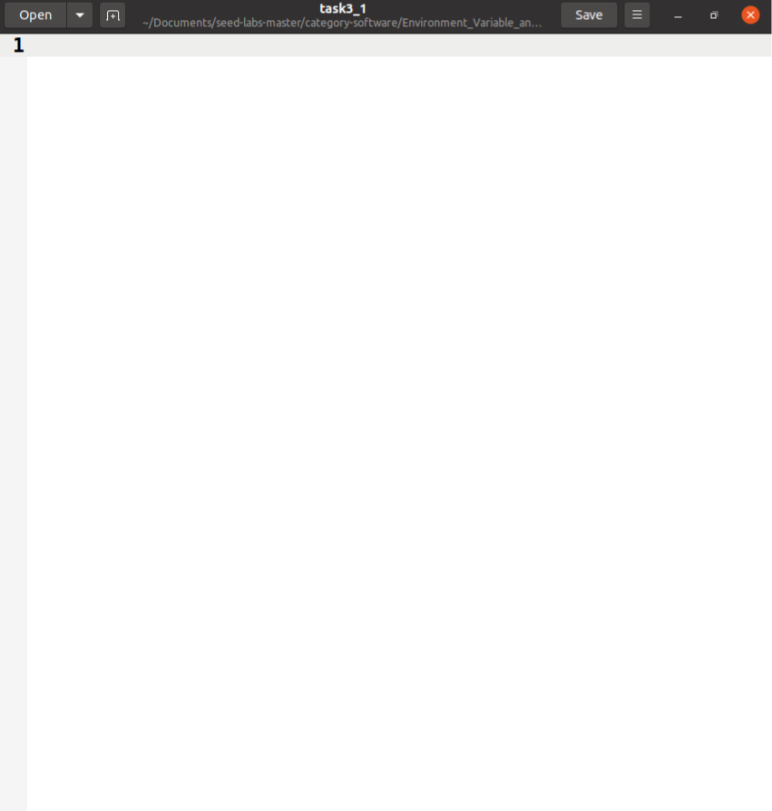

## Task 4: Environment Variables and system()

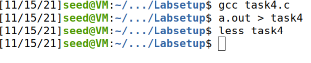
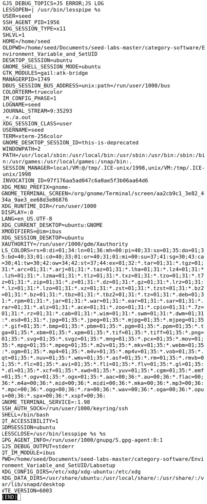

## Task 5: Environment Variable and Set-UID Programs

All the environment variables set in the parent process get into the child process (as seen in the last screenshot of this section). This means that when the child process is created, during the fork, all the variables are the same which is what we expected since the fork duplicates the process.

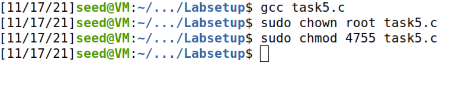
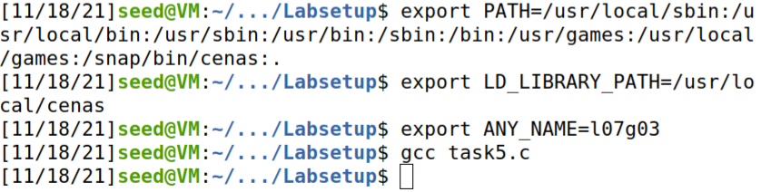
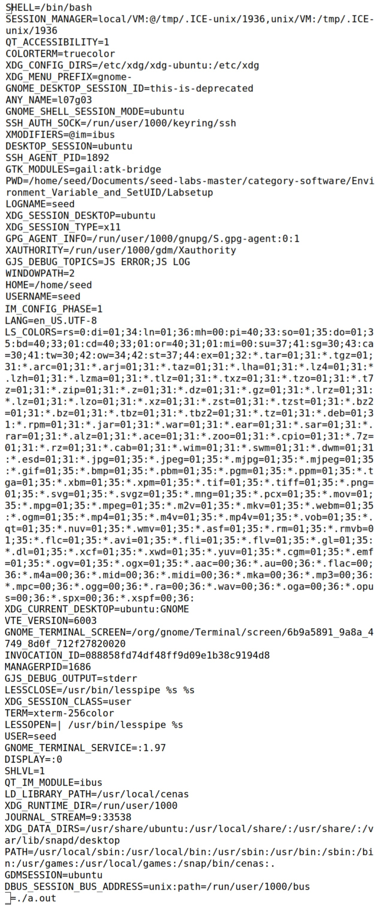

## Task 6: The PATH Environment Variable and Set-UID Programs

By creating a file with the malicious code (in our case our code only printed the sentence "malicious code") in the /home/seed: directory named ls, when recompiling the original code and changing the path, we were able to run some code. We concluded that it happens because the system call with "ls" gives the chance for a file with that name to be run and the command /bin/ls is not executed everytime. That translates to a vulnerability.

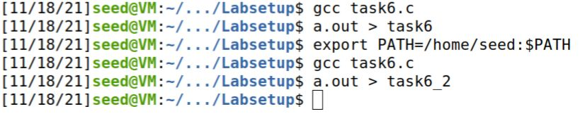
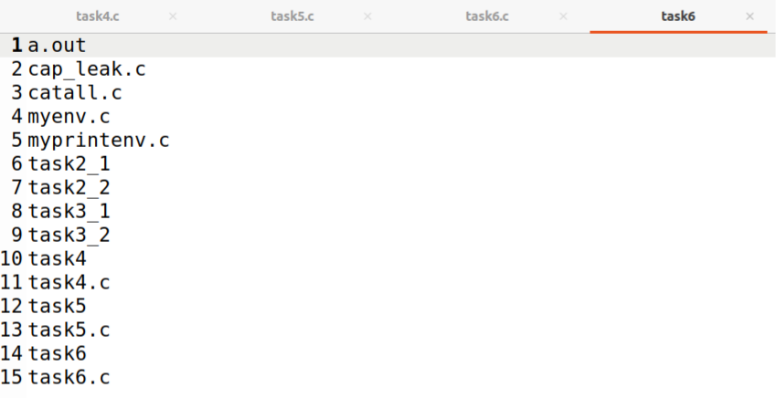
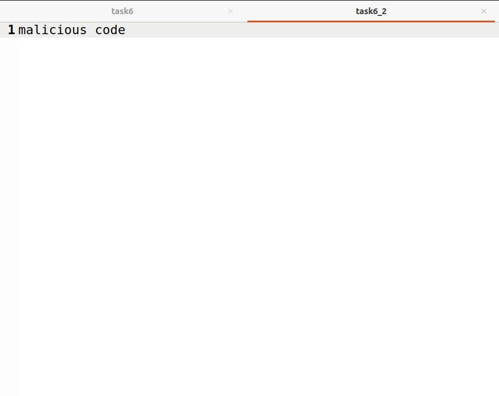

## Task 7: The LD PRELOAD Environment Variable and Set-UID Programs
[todo]: <> ()

## Task 8: Invoking External Programs Using system() versus execve()
[todo]: <> ()

## Task 9: Capability Leaking
[todo]: <> ()
