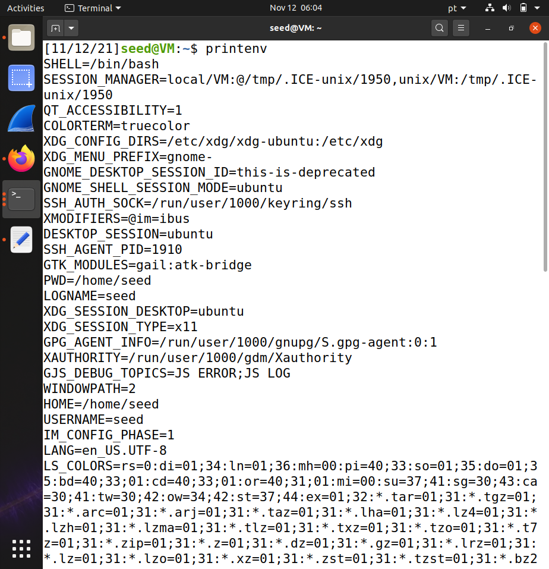
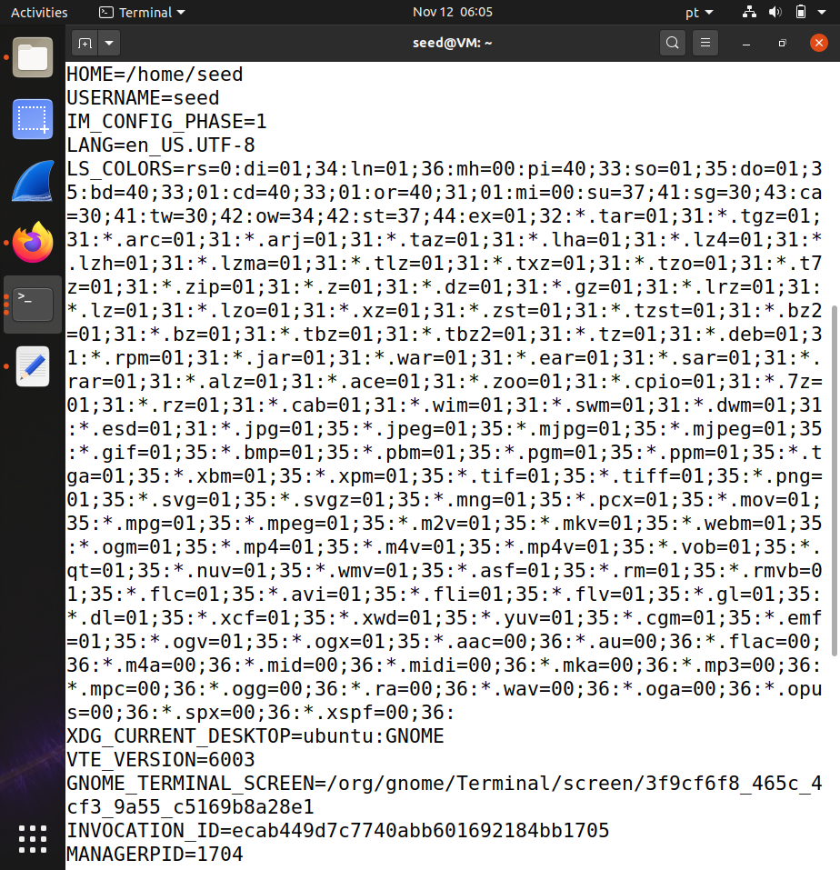
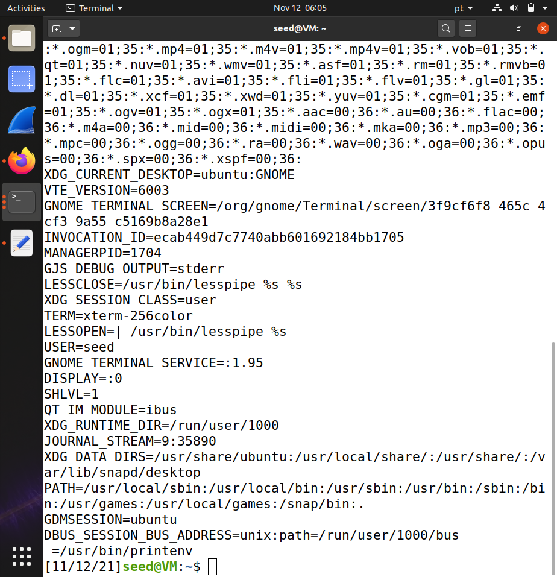
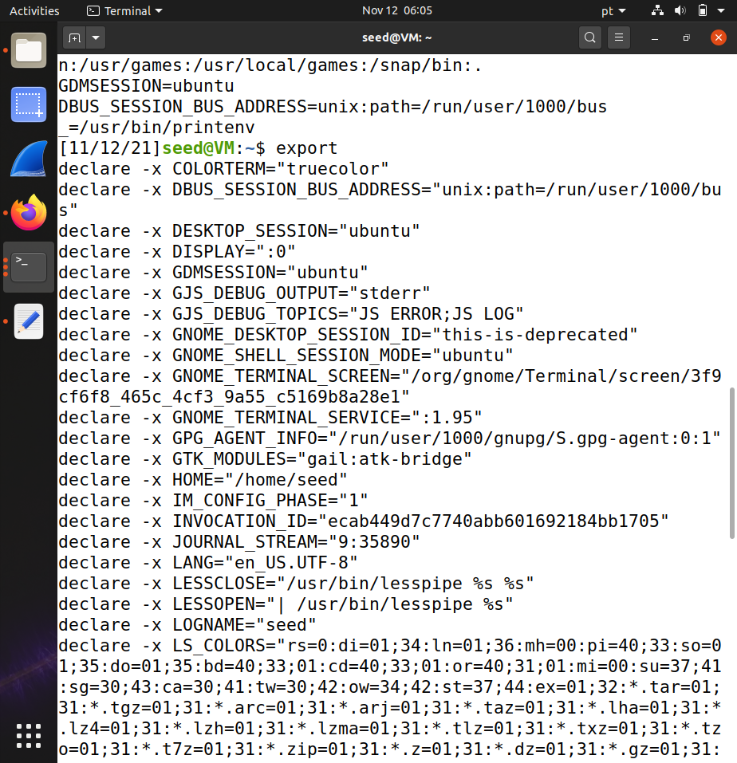
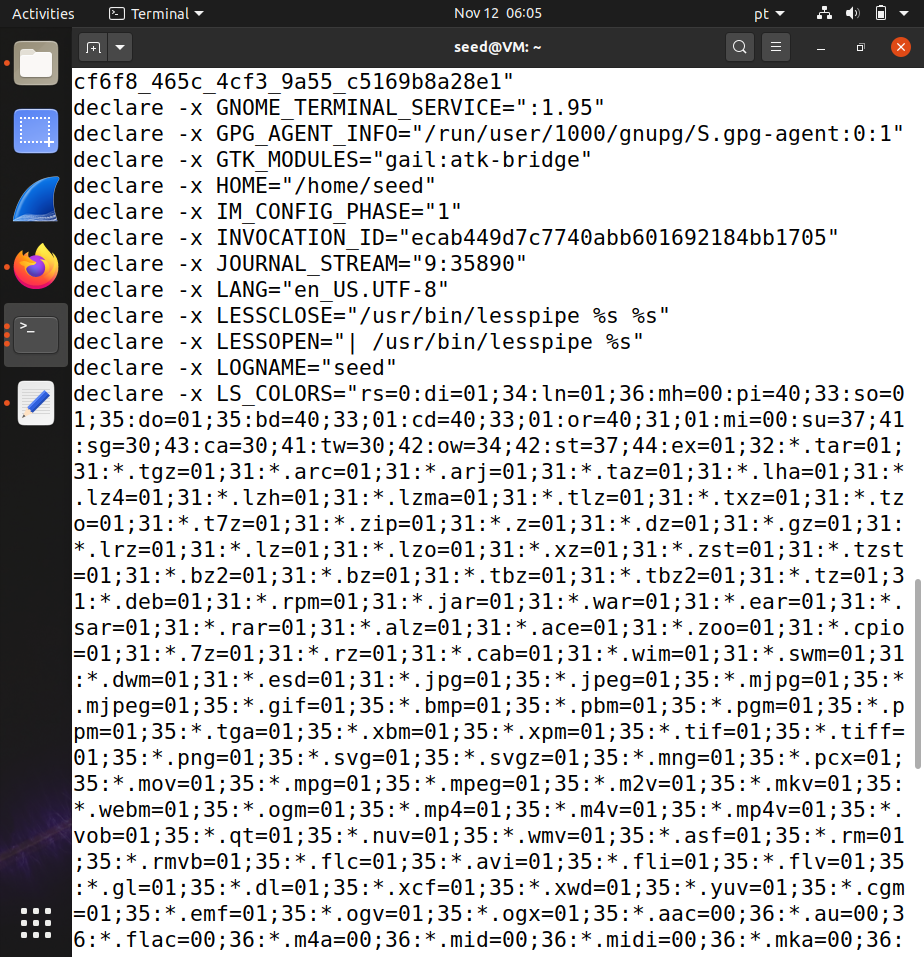
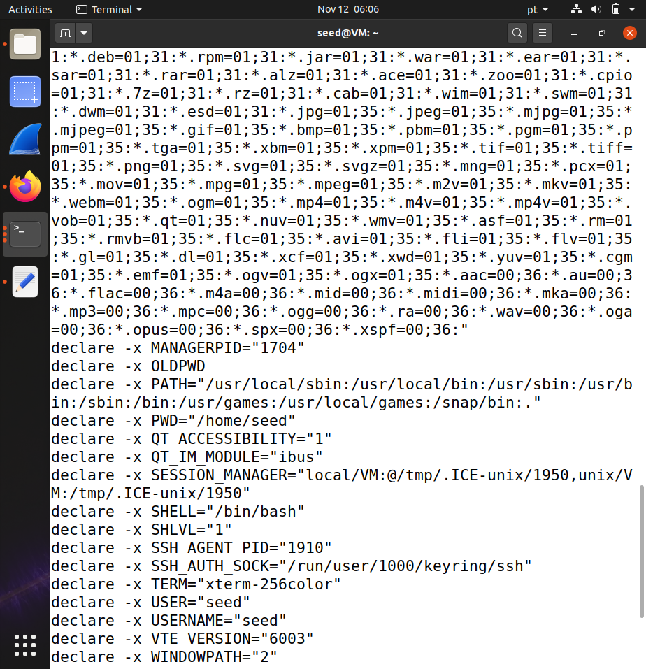

# Environment Variable and Set-UID Program Lab

## Task 1: Manipulating Environment Variables

In the first task, several commands such as env, printenv, export and unset, among others, were used in order to have a better understanding of the functioning and manipulation of environment variables.

* Firstly, by using the printenv command we were able to print out the environment variables, as seen below. 

* Secondly, we used export and unset in order to manipulate the environment variables. When using export without any further arguments, it is returned a list of the environment variables (similarly to printenv), as shown in the first screenshot. Here, we can see that HOME has a default value of (?). Then, when inserting a variable name as argument (HOME), as shown in the X screenshot, as well as its new value ([NEW VALUE (.../cenas)]), we were able to set this new value to the HOME variable. (completar de acordo com novos screenshots)

(Using export and unset to set or unset environment variables:)
(change screenshots to new ones)

## Task 2: Passing Environment Variables from Parent Process to Child Process
[todo]

## Task 3: Environment Variables and execve()
[todo]

## Task 4: Environment Variables and system()
[todo]

## Task 5: Environment Variable and Set-UID Programs
[todo]

## Task 6: The PATH Environment Variable and Set-UID Programs
[todo]

## Task 7: The LD PRELOAD Environment Variable and Set-UID Programs
[todo]

## Task 8: Invoking External Programs Using system() versus execve()
[todo]

## Task 9: Capability Leaking
[todo]
