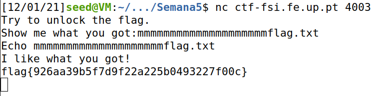
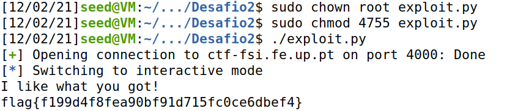
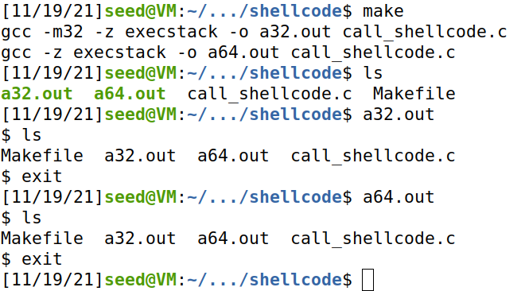
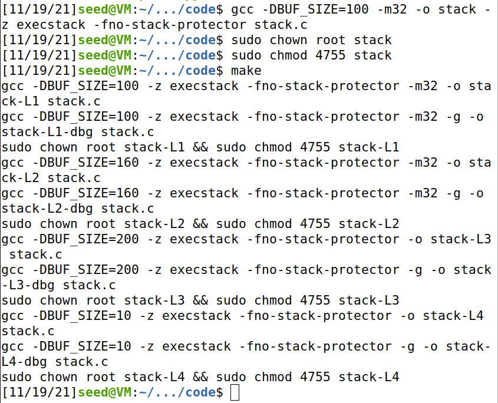
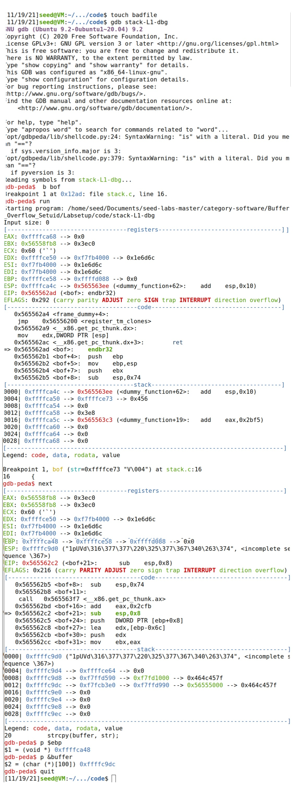
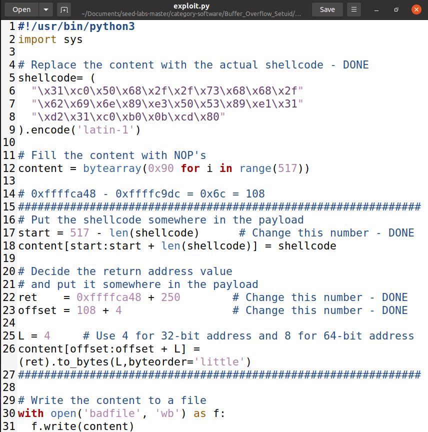
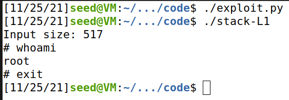

This logbook is divided into 2 sections, one referring to the CTF - week 5, and another concerning the tasks for week 5.

# CTF - Week 5

## Challenge 1

During the first challenge we had the goal of understanding the vulnerability found related to buffer overflow. Having that in mind we started by analysing the given code and answering the questions below:

* **Is there any file opened and read by the program?**
Yes, the program opens the file with the name attributed in the beginning of the program (mem.txt).
* **Is there any way of control which file is opened?**
It is possible if we change the name of the file that we want to open in the declaration of *meme_file*.
* **Is there any buffer-overflow? If so, what can you do?**
It can occur a buffer-overflow since the buffer that allows the user to write allocates memory for 20 characters but then, the function *scanf* reads 28 characters and those would be saved on the space used for the variable *meme_file*. Doing so, we alter the file from which we read and the flag needed is presented.

## Challenge 2

For the second challenge, we did almost the same as in the previous one, answering the following questions:

* **What alterations were made?**
A *val* variable is used, the *scanf* function reads 32 characters instead of 28 and the file is only opened if the *val* variable is equal to *0xfefc2122*. Appart from that the code is similar to the one presented on the previous challenge.
* **Do they fully mitigate the problem?**
They do not because it adds 4 characters that need to become different and there are only 4 characters to work with.
* **Is it possible to overcome mitigation using a technique similar to the one used before?**
Yes, it is possible since there is only the case of adding the *val* with the value equal to *0xfefc2122* in the middle of the sequence used before. In this case we used the string *"mmmmmmmmmmmmmmmmmmmm\x22\x21\xfc\xfeflag.txt"* since the first 20 characters were not relevant for the exercise, the next 4 characters were the variable *val* with the correspondent value, but written in the opposite and the final part of the string is the name of the file we want to open and read.

____
____

# Buffer Overflow Attack Lab

## Task 1: Getting Familiar with Shellcode

When running the a32.out and the a64.out files, a shell is launched and we can use it, as we can see in the following screenshot. In this case we used the command "ls".

## Task 2: Understanding the Vulnerable Program

During the second task, we compiled the vulnerable program and made it a root-owned SET-UID program, as seen in the following screenshot.

## Task 3: Launching Attack on 32-bit Program

In the first part of the task we used a debugging method to search for the ebp value and the buffer's address. We noted that the ebp was 0xffffca48 and the buffer's address was 0xffffc9dc as seen in the screenshot below.

By opening the exploit.py code we were able to see that the bytes before the return address were filled with NOP's instructions. This instructions are for no operation, which provoques the jump for the next instruction. To improve the chance of success of jumping to the part of the stack that contains the shellcode, we can put the shellcode after the NOP instructions so we can eventually get to the shellcode. The code in the next screenshot shows that we started to write the shellcode at the end of the stack, so the start variable needs to be the subtraction between 517 and the length of the shellcode. On the ret variable we opted to use the return value plus 250 which make the return value jump to the middle of the NOP's and we eventually are able to read the shellcode. Then the offset was calculated by the offset between the ebp and the buffer witch is 108 and we added 4 which was the size of the return value.

With this, we are able to use the files with root permission now.

