This logbook is divided into 2 sections, one referring to the CTF - week 6, and another concerning the tasks for week 6.

# CTF - Week 6

## Challenge 1

After running checksec we concluded that the file architecture is x86 (Arch), there is a mitigation that makes some read-only addresses of some funcions defined at the executable's startup (RELRO), there is a cannary protecting the return address (Stack), the stack has no execute permission (NX) and the binary positions are not randomized (PIE).

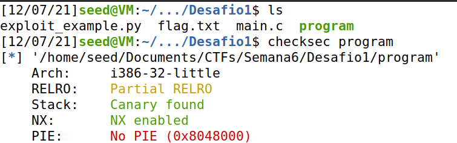

We analysed the given code and answered the questions below:

* **Which is the line of code where the vulnerability resides?**

The vulnerability resides in line 27:

```c
printf(buffer);
```

* **What does the vulnerability allow you to do?**

The vulnerability allows us to check the content of the memory address of the buffer. In this case, we want to check the address of the *flag* variable. We did it using *gdb* as seen in the screenshot below:

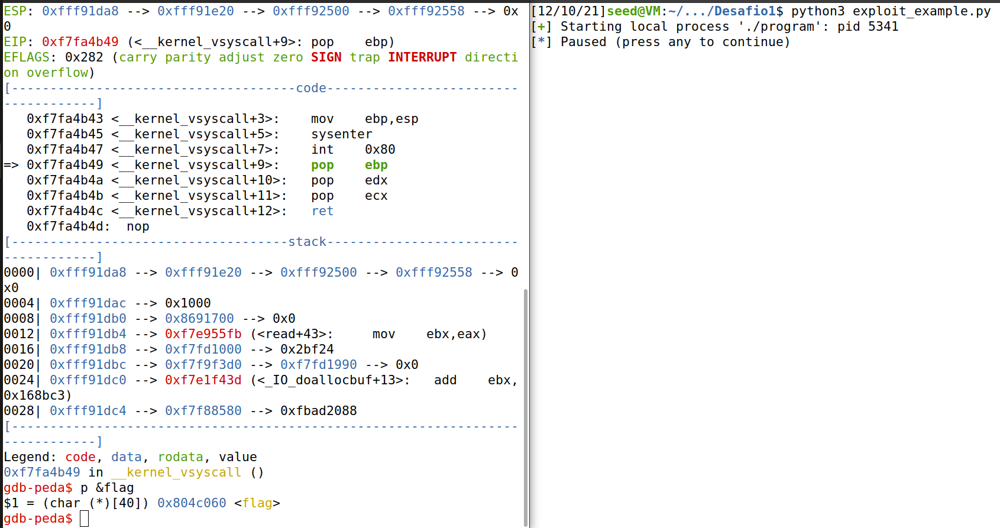

After that, we needed to check the difference between the string *"aaaa"* and the hexadecimal code *61616161*. As we can see in the picture, it is adjacent which means that they belong to consecutive addresses.

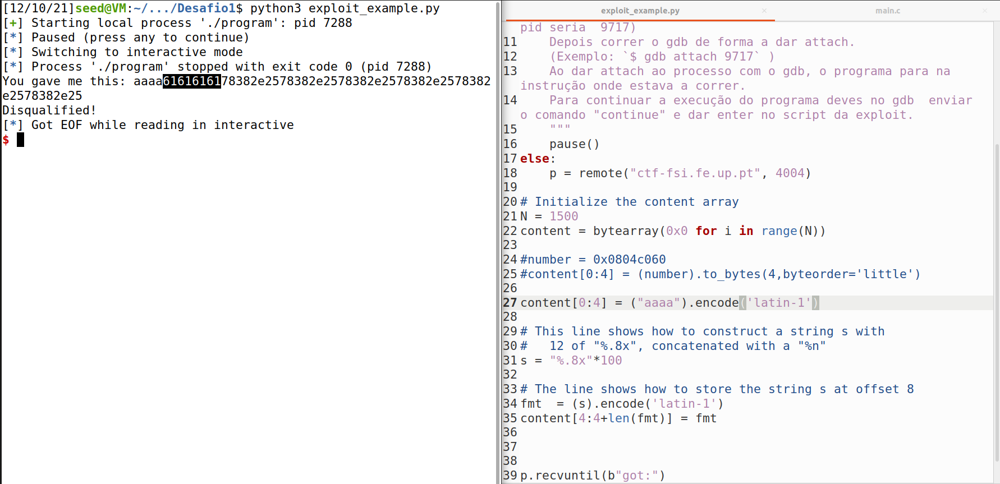

Having that in mind, we can print the content of the address specified in *exploit_example.py*

* **What is the functionality that allows you to get the flag?**

We can get the flag because of a format-string vulnerability, which allows us to read from an arbitrary memory place.

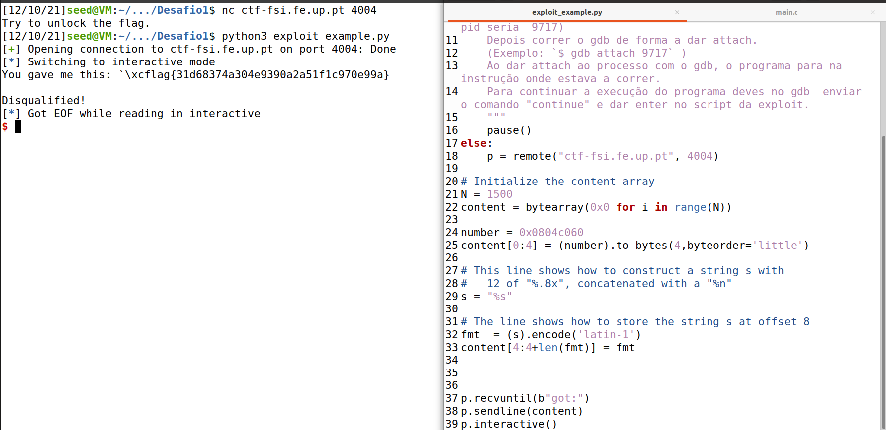


## Challenge 2

After running checksec we concluded that the file architecture is x86 (Arch), there is a mitigation that makes some read-only addresses of some funcions defined at the executable's startup (RELRO), there is a cannary protecting the return address (Stack), the stack has no execute permission (NX) and the binary positions are not randomized (PIE).

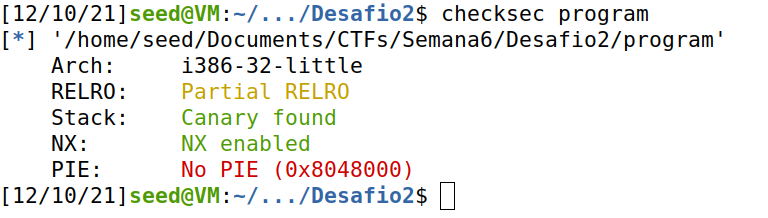

We analysed the given code and answered the questions below:


* **Which is the line of code where the vulnerability resides? What does the vulnerability allow you to do?**

The vulnerability resides in line 14:

```c
printf(buffer);
```

This is a format-string vulnerability which allows us to read from an arbitrary memory place and modify the values in an arbitrary memory place.

* **Is the flag loaded into memory? Or is there some functionality that we can use to access it?**

No, it is not. We can access the flag through the shell that opens when the *key* value is equal to *0xbeef*.

* **What do you have to do to unlock this feature?**

To see the flag, we can change the value of the *key* variable so the shell runs. For that, we need to take advantage of the format-string vulnerability to change that value. We sarted by see which is the address of the *key* variable, as seen in the screenshot below:

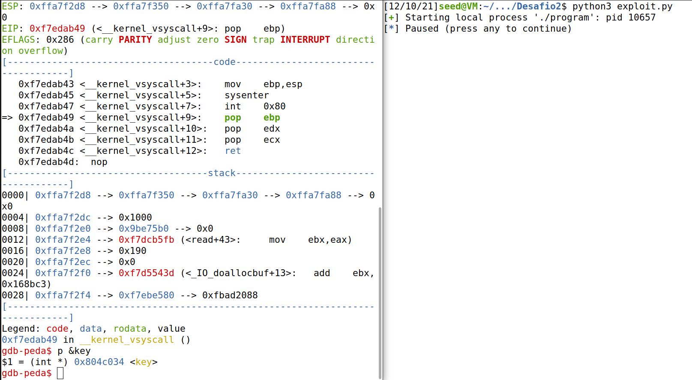

After that, we checked the distance between the string *"aaaa"* and the hexadecimal code *61616161*. As we can see in the picture, it is adjacent, meaning that they belong to consecutive addresses.

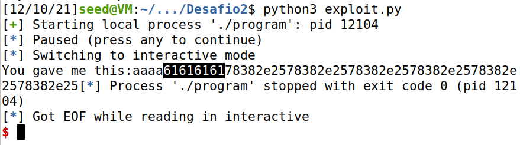

Having that in mind we needed to write the value *0xbeef* into address *0x0804c034*. To do that we started by writing into the buffer *aaaa*, then the address of the *key* variable and then the 
value that we needed. That was calculated keeping in mind that:

> 48879 - 4 - 4 = 48871

Where, *48879* is the decimal value of *0xbeef*, then we needed to subtract 4 characters for the begining of the string (*"aaaa"*) and then subtract 4 characters corresponding to the characteres needed to write the address value. After that, we were able to run the code and a new shell was presented. We used "cat flag.txt" to print the content of the file in which we could see the required flag.

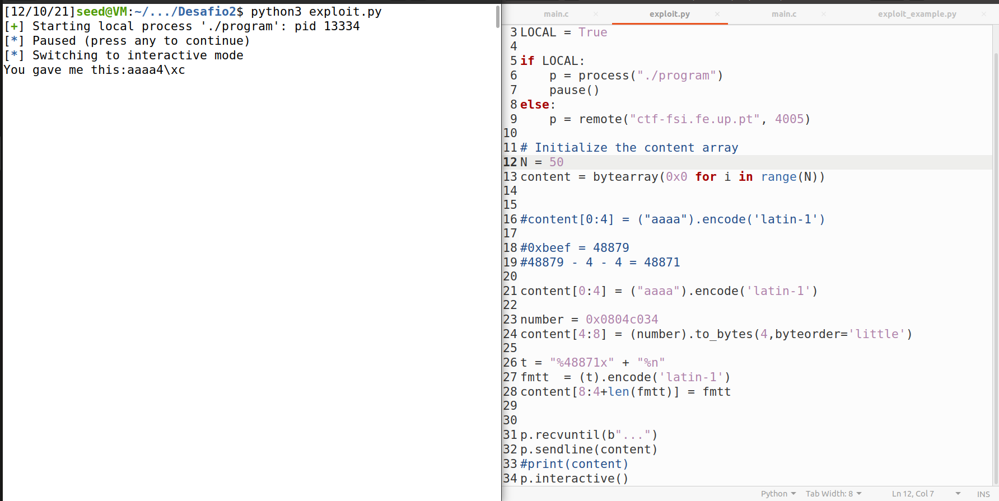
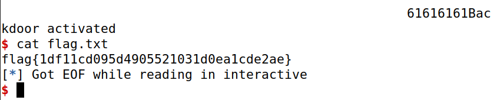

____
____

# Format String Attack Lab

## Task 1: Crashing the Program

In the first task, we started by sending a *hello* message, as seen in the picture below.

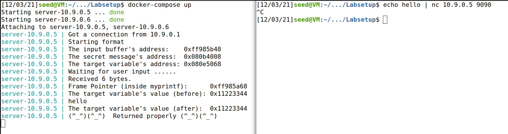

After that, the goal was to exploit the format-string vulnerability. In this case, it was necessary to send a string with more than 1500 bytes (which is the limit of he server). For that, we used the *build_string.py* file to send it. With that, we saw that the message of "Returned properly" was not returned, which means that, probably, the *format* program has crashed.

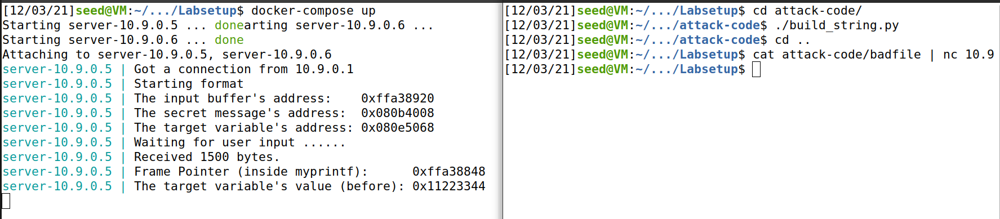

## Task 2: Printing Out the Server Program's Memory

### Task 2.A: Stack Data

During this task we stored *"aaaa"* in the beginning of the string, then added 100 *%.8x*. With that we can see what is the distance between the string *"aaaa"* and the address passed to the *printf* function. The output is the one showed below and we selected the characters between *"aaaa"* and the hexadecimal code for that (61616161). We counted 504 characters, which divided by 8 correspond to 63 bytes.

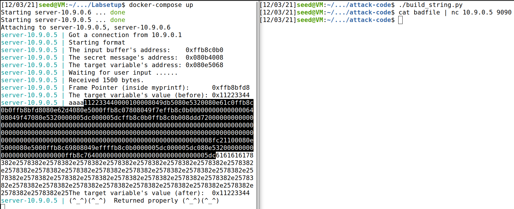

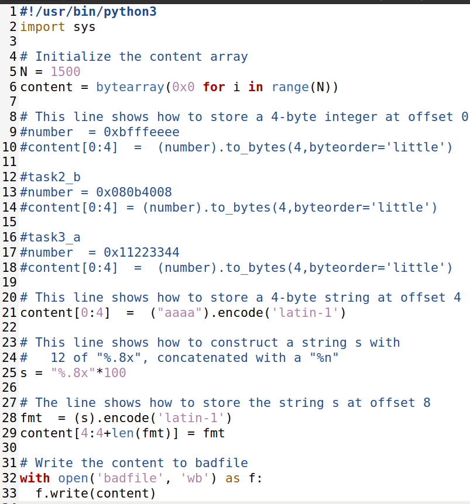

### Task 2.B: Heap Data

By adding the 63 *"%x"*, we move the printf's pointer towards the address containing the secret message. Once we reach the destination, we gave a *"%s"*, which prints the content of the memory address *0x080b4008*, that corresponds to the secret message. In the picture, at the end we can see "A secret message" displayed.

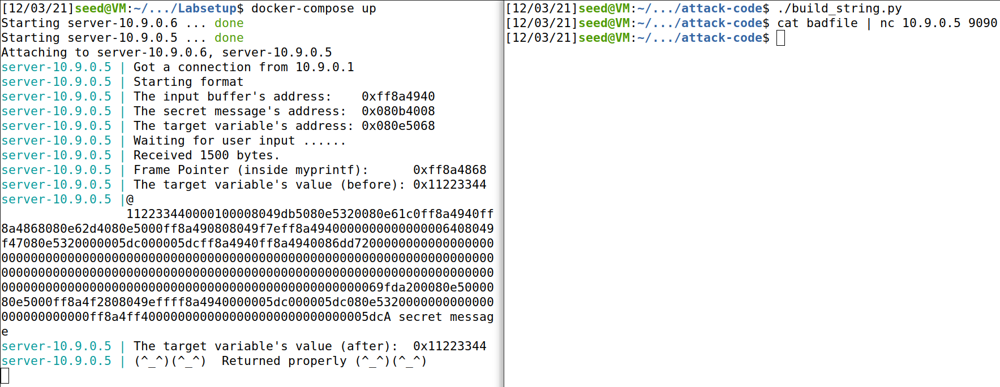

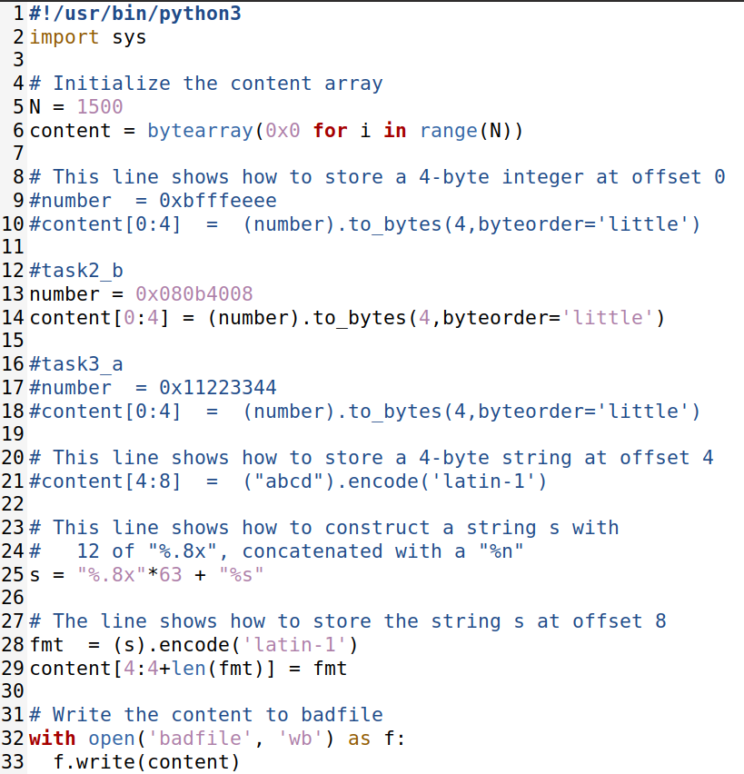

## Task 3: Modifying the Server Program's Memory

### Task 3.A: Change the value to a different value

In this task we needed to change the value of the *target* variable. For that, we changed the code to write at the beginning of the string the address *0x080e5068*, then we added the 63 *"%x"* to move the printf's pointer towards that address. We then wrote a "newMessage" and then *"%n"* so the address could be overwritten, as seen in the picture below. At the end, we can see that the target variable's value changed from *0x11223344* to *0x0000015d*.

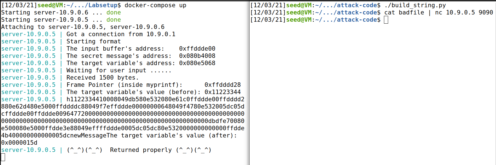

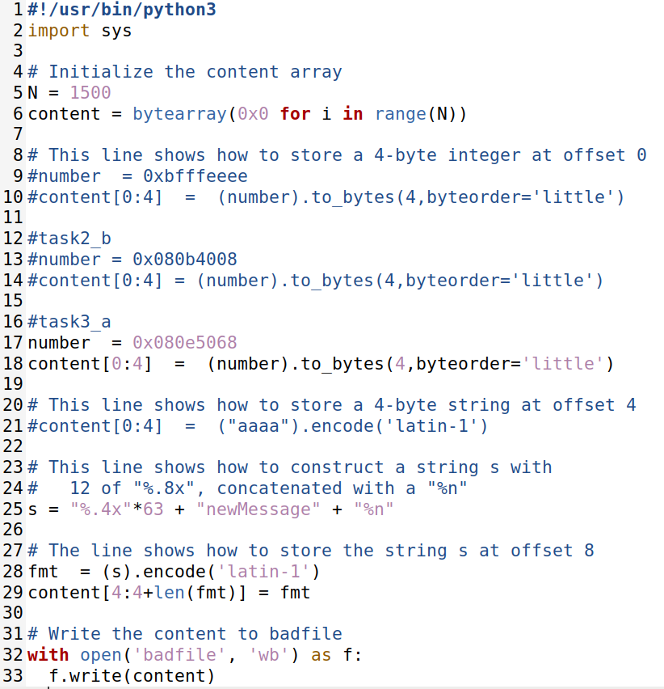

### Task 3.B: Change the value to 0x5000

To change the target variable's value to *0x5000* we started to see that it corresponds to 20480 in decimal. That means that we need to write 20480 bits of information, however the server has a limit of 1500. To overcome this problem we took advantage of the printf function's width parameter to add a larger number of characters. For that we had: 

> 20480 - 4 - 62*8 = 19980

In this case, we subtracted from the starting number 4 bits that correspond to the target address *0x080e5068* and the 62 bytes of the difference that we discovered during task 2.A. That means that we needed to add 19980 bits. The picture shows that the target variable's value changed from *0x11223344* to *0x00005000*.

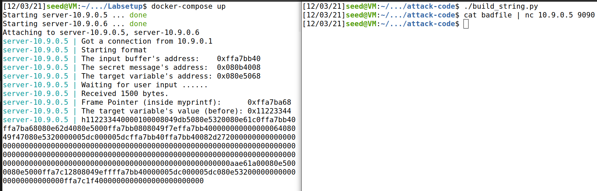

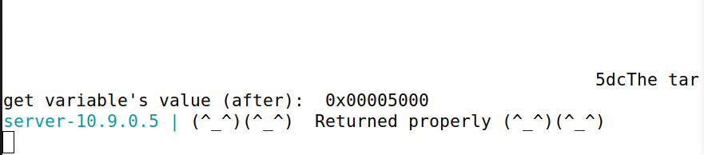

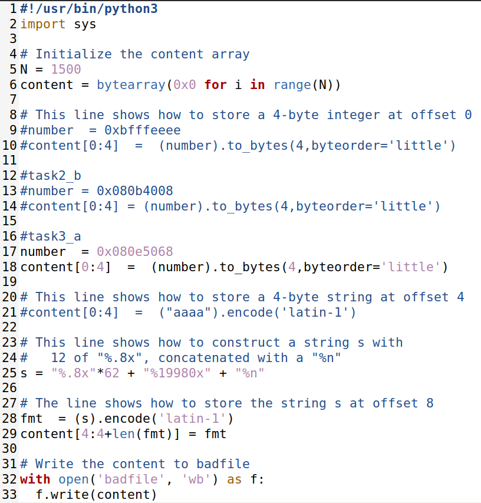
