This logbook is divided into 2 sections, one referring to the CTF - week 8/9, and another concerning the tasks for week 8/9.

# CTF - Week 8/9

## Challenge 1
<!---

-->

## Challenge 2

<!---

-->
____
____

# SQL Injection Attack Lab

## Task 1: Get Familiar with SQL Statements

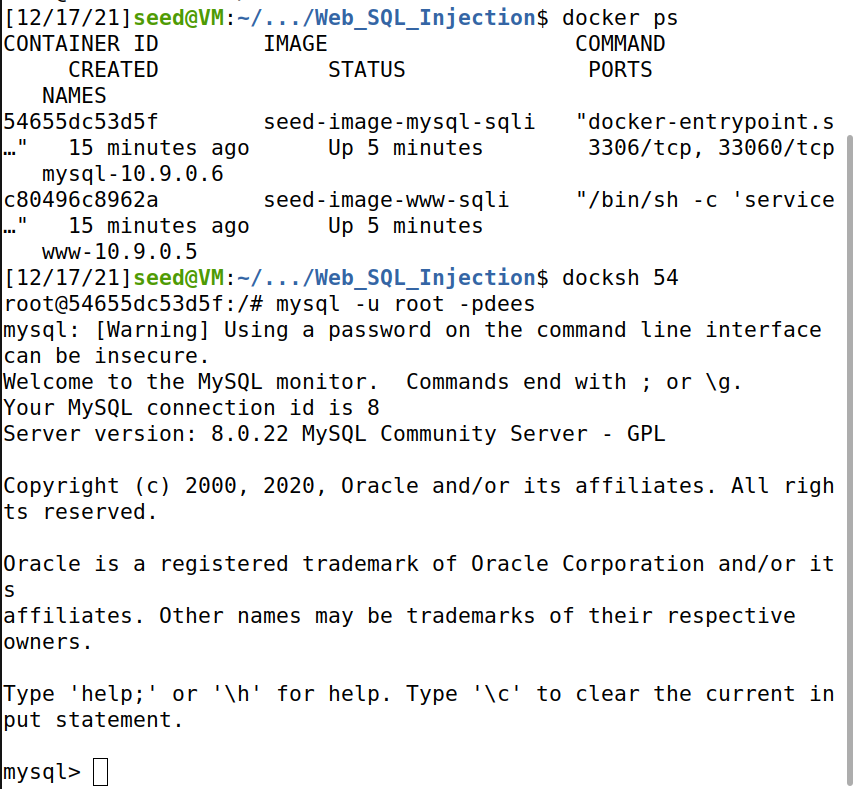

During the first task, we loaded the provided database and run an SQL command to print all of Alice's profile information. For that we used:

```sql
SELECT * FROM credential WHERE Name = 'Alice'
```
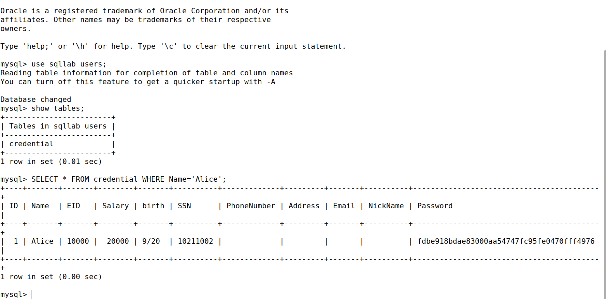

## Task 2: SQL Injection Attack on SELECT Statement

In the second task, the goal was to see information from a database using SQL injection.

### Task 2.1: Injection Attack from webpage

In this case, we needed to see the admin information without using the admin password. For that, we used as the username *admin'#*. With that we could comment the part that had the password variable. With that, we were able to see the admin information.

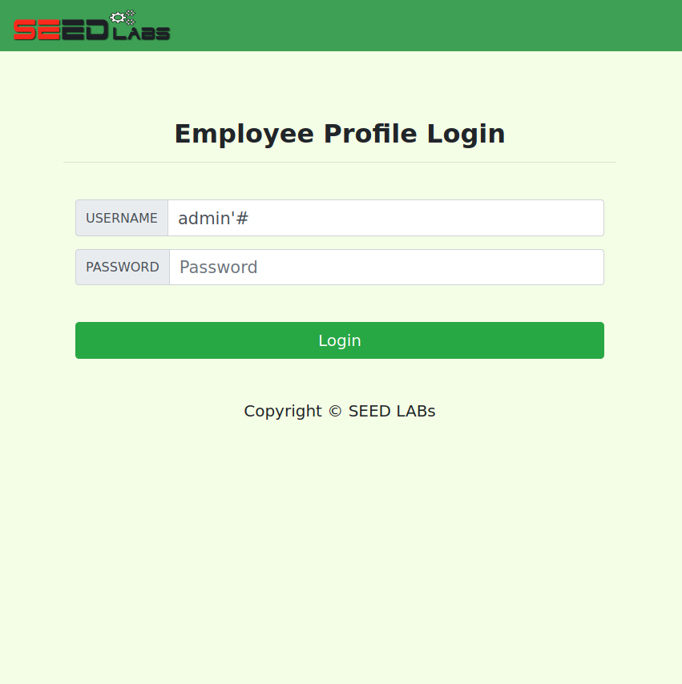


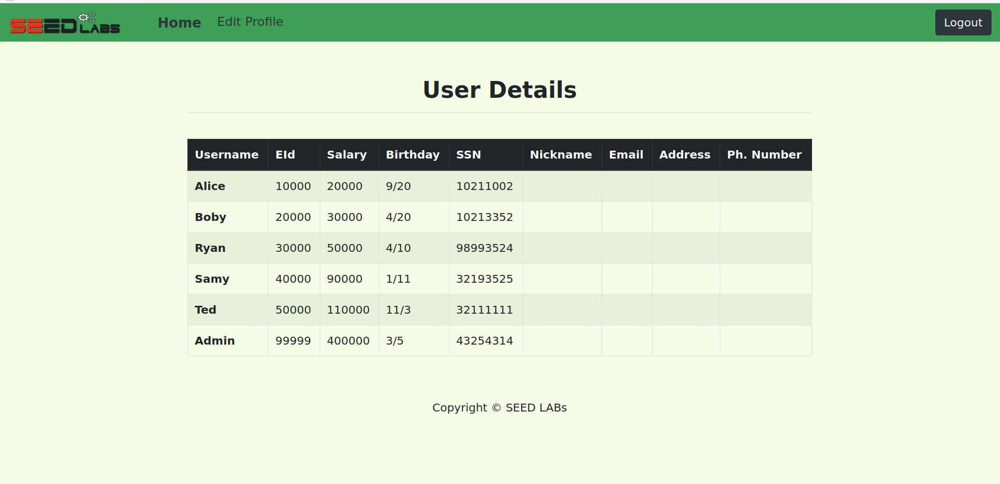

### Task 2.2: SQL Injection Attack from command line

In this part, we needed to repeat the previous task, but without using the webpage. For that we used the command line with: 
```
curl 'www.seed-server.com/unsafe_home.php?username=admin%27%23&Password='
```
By doing this, we could see the admin information:

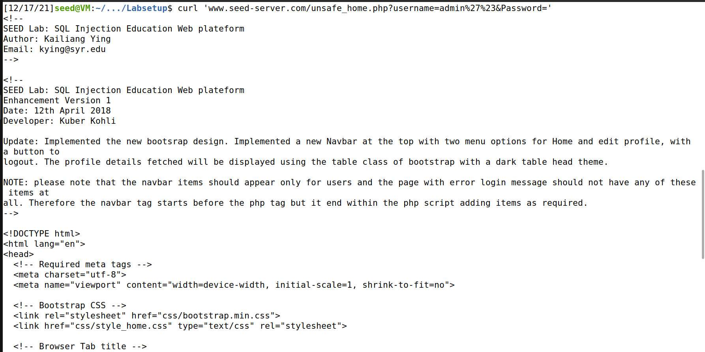

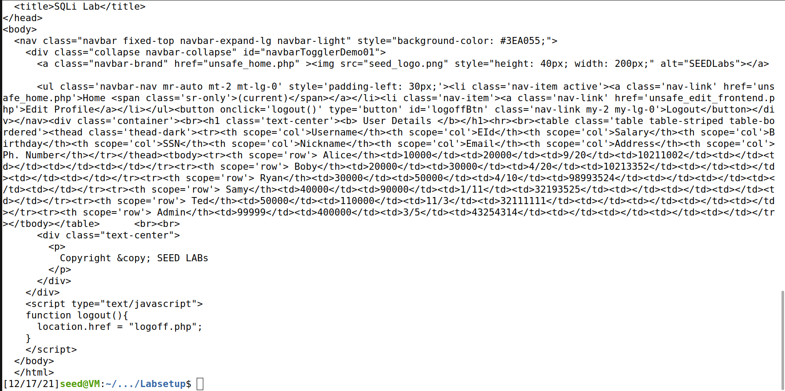

### Task 2.3: SQL Append a new SQL Statement

In this part of the task, we tried to run two SQL statements in the attack, however it was not possible. That happened because the *mysqli* PHP extension is used, which doesn't allow the execution of multiple queries.


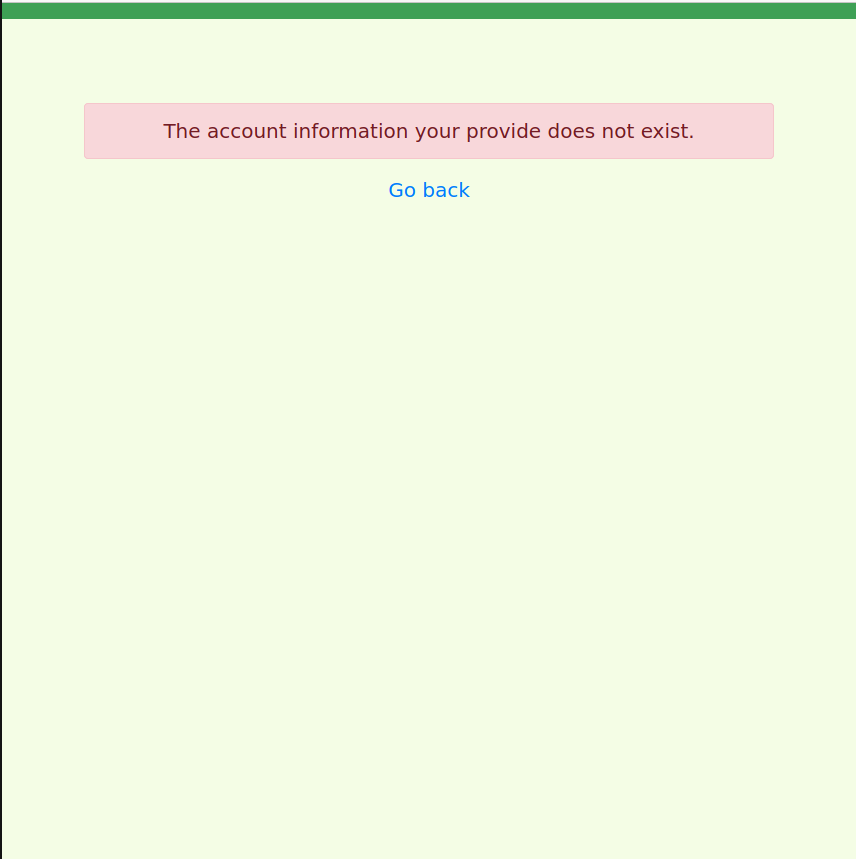

## Task 3: SQL Injection Attack on UPDATE Statement

In the third task, the goal was to modify the database information.

### Task 3.1: Modify your own salary

In the first part, we needed to modify the value of the salary using the edit profile functionality. We did this using *', salary='100000*. With that, we could change the SQL UPDATE statement to update the salary as well.

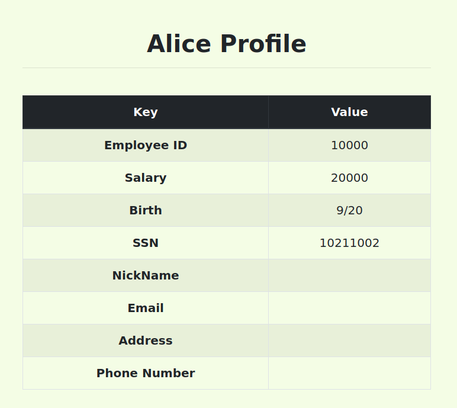

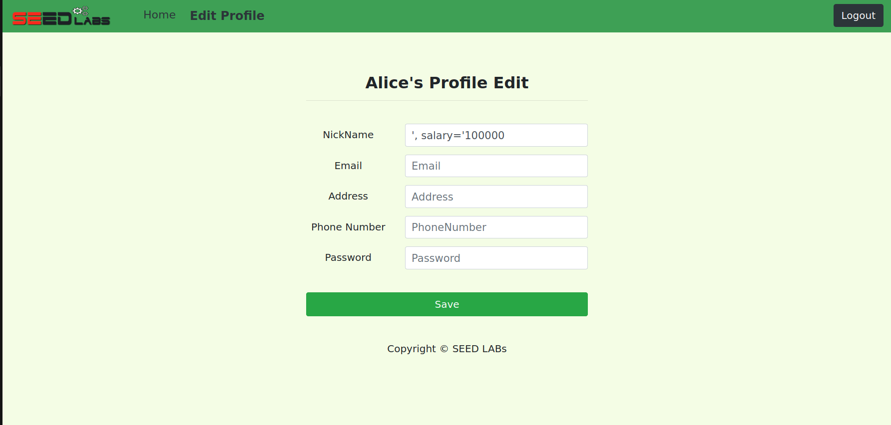

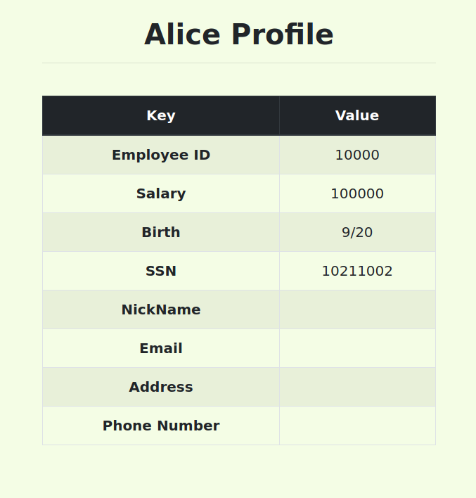

### Task 3.2: Modify other people' salary

In this part we needed to change someone else's salary. To do this, we used *', salary=1 WHERE Name='Boby';#*.

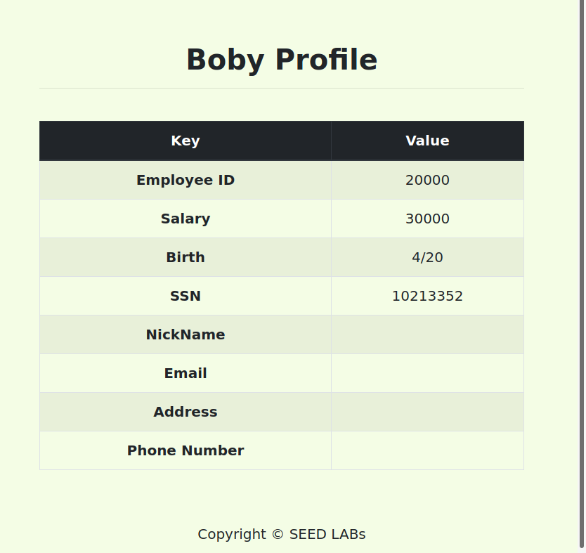

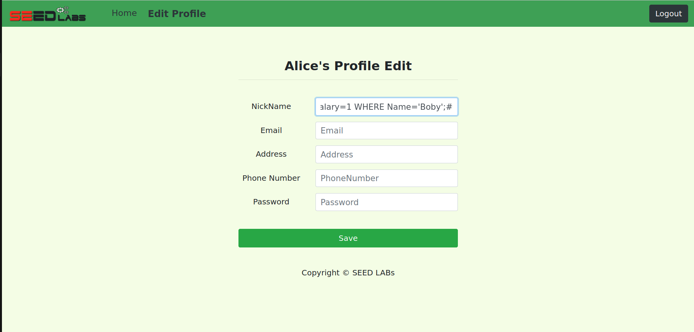

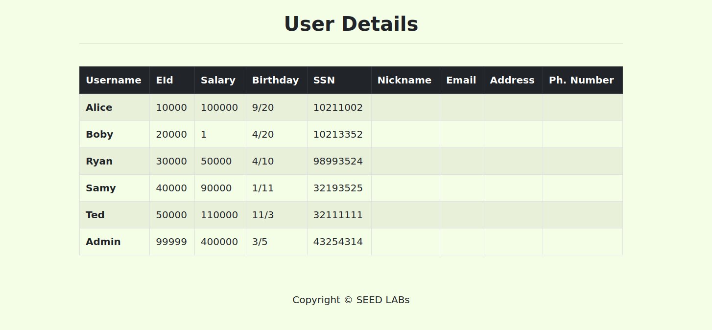
