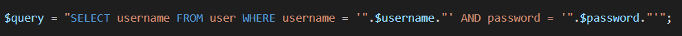
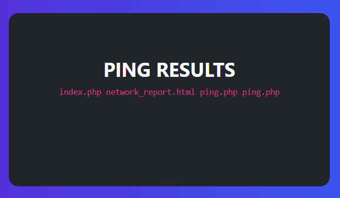
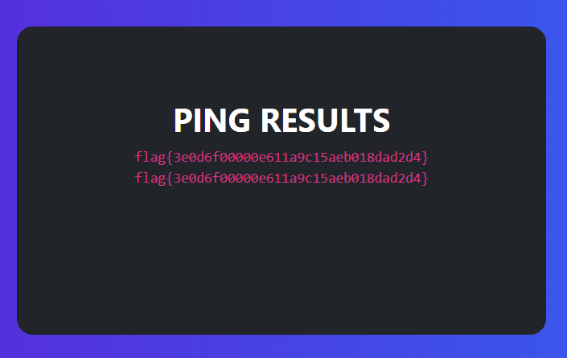
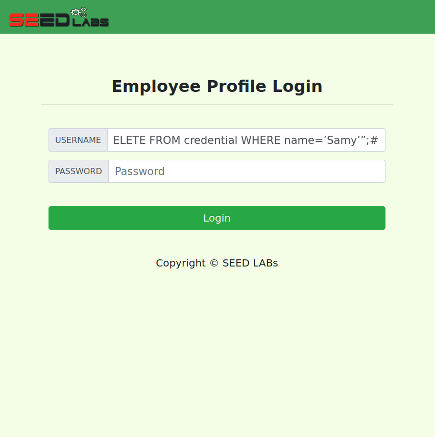

This logbook is divided into 2 sections, one referring to the CTF - week 8/9, and another concerning the tasks for week 8/9.

# CTF - Week 8/9

## Challenge 1

When examining the given source code, a vulnerability in the login section is identified in line 40:



Here we can verify that the query is generated server-side, which generates SQL commands dinamically. Through this, we can change the semantics of the SQL command and enter the admin session through SQL injection, by entering `' or 1=1 --` in the username field. 

Since `or 1=1` is always true and the rest of the instruction is commented, this will change the query to `SELECT * FROM users WHERE username = '' OR 1=1-- ' AND password = 'foo'`, which will return all users and therefore giving us access to the admin's account.

## Challenge 2

By examining the page, the only visible functionalities available to a non authenticated user are the following:

- login using an email and a password
- ping a host
- ask for a speed report

The relevant functionality for this CTF was pinging a host, which was concluded to be implemented by executing a shell command and then display the output. This was suspected to be achieved through the `system()` function, which executes a specified command and returns after it has been completed. 

This led to a possibility of shell code injection, once the `host` field was found to execute any linux command that was introduced. 
In order to add a command, we used `;` in the beginning of the string, followed by the instruction and ending in `#`, so that a command in the same line would be executed and commenting what would come afterwards. We noticed that in this case the result was the same without the `#` element.

Once the objective was to get to the flag which was written in the flag.txt file, we used the following as input: `; cat /flag.txt #`, which opens the file flag.txt and returns its content.

- Using the command `; ls` :



- Using the command `; cat /flag.txt #` or `; cat /flag.txt`:



____
____

# SQL Injection Attack Lab

## Task 1: Get Familiar with SQL Statements


During the first task, we loaded the provided database and run an SQL command to print all of Alice's profile information. For that we used:

```sql
SELECT * FROM credential WHERE Name = 'Alice'
```


## Task 2: SQL Injection Attack on SELECT Statement

In the second task, the goal was to see information from a database using SQL injection.

### Task 2.1: Injection Attack from webpage

In this case, we needed to see the admin information without using the admin password. For that, we used as the username *admin'#*. With that we could comment the part that had the password variable. With that, we were able to see the admin information.


### Task 2.2: SQL Injection Attack from command line

In this part, we needed to repeat the previous task, but without using the webpage. For that we used the command line with: 
```
curl 'www.seed-server.com/unsafe_home.php?username=admin%27%23&Password='
```
By doing this, we could see the admin information:


### Task 2.3: SQL Append a new SQL Statement

In this part of the task, we tried to run two SQL statements in the attack, however it was not possible. That happened because the *mysqli* PHP extension is used, which doesn't allow the execution of multiple queries.




## Task 3: SQL Injection Attack on UPDATE Statement

In the third task, the goal was to modify the database information.

### Task 3.1: Modify your own salary

In the first part, we needed to modify the value of the salary using the edit profile functionality. We did this using *', salary='100000*. With that, we could change the SQL UPDATE statement to update the salary as well.


### Task 3.2: Modify other people' salary

In this part we needed to change someone else's salary. To do this, we used *', salary=1 WHERE Name='Boby';#*.


